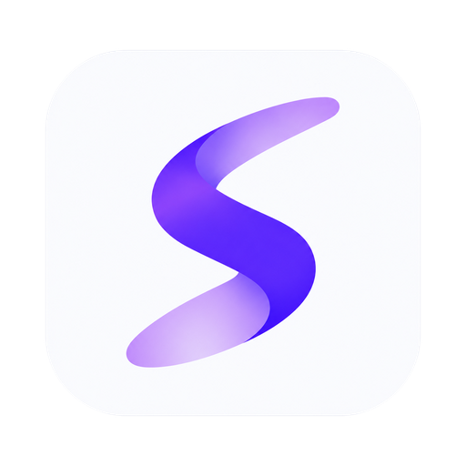
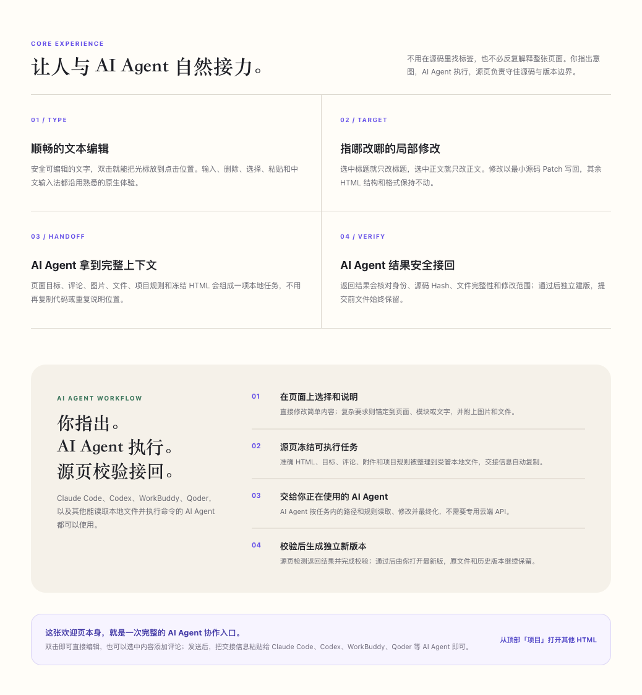

<p align="center">
  
</p>

<h1 align="center">PageRoot</h1>

<p align="center">
  <strong>Edit visually. Collaborate with AI agents. Stay in source.</strong><br />
  A local-first, source-preserving visual HTML workspace for macOS, built for seamless collaboration with AI coding agents.<br /><br />
  <strong>所见即可改，AI Agent 无缝接力，源码始终是真相。</strong><br />
  面向 macOS 的本地优先、源码保真可视化 HTML 工作台。
</p>

<p align="center">
  <a href="https://github.com/Charleyli925/PageRoot/releases/latest"></a>
  <a href="https://github.com/Charleyli925/PageRoot/actions/workflows/ci.yml"></a>
  
  
  <a href="LICENSE"></a>
</p>

<p align="center">
  <a href="https://github.com/Charleyli925/PageRoot/releases/latest"><strong>Download for Apple silicon</strong></a>
  · <a href="#english">English</a>
  · <a href="#chinese">中文</a>
  · <a href="docs/ARCHITECTURE.md">Architecture</a>
  · <a href="https://github.com/Charleyli925/PageRoot/issues/new/choose">Report an issue</a>
</p>

<p align="center">
  
</p>

<p align="center">
  <sub>Rendered from the welcome project included with PageRoot · 截取自源页内置欢迎项目</sub>
</p>

<a id="english"></a>

## The visual workspace between your page and your AI agent

PageRoot turns what you point at on a page into an agent-ready local task. Anchor a request to the whole page, a section, specific text, or an insertion point; add comments, images, files, and long-lived project rules; then let PageRoot freeze the exact HTML and every piece of context your AI agent needs.

**Works with Claude Code, Codex, WorkBuddy, Qoder, and other AI agents that can read local files and run commands.** The handoff uses managed local files plus one clipboard instruction, so it does not depend on a provider-specific API or require you to copy the whole HTML into a chat.

```text
Point and comment in PageRoot
  → freeze exact HTML + targets + attachments + project rules
  → hand off one local task to your AI agent
  → validate the result and keep it as a separate version
```

## Visual HTML editing without surrendering your source

PageRoot is a local-first visual HTML editor for macOS—a source-preserving alternative to conventional WYSIWYG website editors for real `.html` files. Open a local page, double-click supported text, and edit with the browser’s native caret, selection, paste, and input-method behavior. PageRoot maps that intent back to the exact source range and writes a minimal patch instead of serializing the preview DOM.

For larger or generative changes, PageRoot prepares a complete local task package and copies one concise handoff instruction. Your AI agent reads the frozen HTML and declared context, writes one complete HTML result to the designated output path, and runs the included finalizer. PageRoot then validates identity, source hash, path, integrity, and allowed scope before keeping the result as a separate version that you choose when to open.

It is built for people editing landing pages, prototypes, documentation pages, and static pages generated by AI agents or authored by hand—without giving up visual speed or source fidelity.

### Why PageRoot

- **Edit directly on the page.** Double-click safe text, place the caret where you clicked, type with a native-feeling workflow, format supported text, and reorder supported sibling sections.
- **Preserve the HTML you actually own.** Every persistent visual edit becomes a source-level patch limited to the resolved target. Unrelated markup, formatting, and authored structure are not rebuilt from the DOM.
- **Review changes in context.** Comments stay attached to page, section, text, or insertion targets. Images and files travel with the comment, so the request and its evidence remain together.
- **Use the AI agent you already trust.** The local-file handoff works with Claude Code, Codex, WorkBuddy, Qoder, and other filesystem-capable agents; PageRoot does not launch, control, or paste into them.
- **Bring AI agent changes back as verified versions.** The submitted source is frozen, returned HTML must pass fail-closed checks, and pre-submit files remain available.
- **Detect conflicts instead of overwriting them.** Local writes are serialized and atomic; an unexpected external file change pauses writeback and asks you to resolve it.

<p align="center">
  
</p>

### From a local HTML file to a verified version

1. **Open and edit.** Open a real local HTML file. Safe text edits and supported visual adjustments write back automatically through precise source patches.
2. **Comment and hand off.** Mark the exact place that needs a larger change, add context or attachments, then let PageRoot freeze and copy the agent-ready handoff.
3. **Validate and choose.** PageRoot checks the returned full HTML before creating a new immutable version. Your current file is not silently replaced; you explicitly open the latest version.

### Source-first by design

```text
Authored HTML
  → native DOM / Selection / IME intent
  → SourceIndex + TargetResolver
  → minimal SourcePatch
  → hash-checked atomic file write
```

The current HTML bytes are authoritative. Preview DOM is disposable and is never serialized back as the persistence source. PageRoot is not a low-code page builder, and unsafe or ambiguous edits stop instead of guessing.

### Download and requirements

[Download the latest PageRoot DMG](https://github.com/Charleyli925/PageRoot/releases/latest) from GitHub Releases.

- macOS 12 or later
- Apple silicon (`arm64`)
- Current desktop interface: Simplified Chinese
- Current builds use ad-hoc signing and are not Apple-notarized. On first launch, Control-click PageRoot and choose **Open** if macOS blocks it.
- Verify the DMG with the release’s `SHA256SUMS.txt`. Every official release also includes `update-manifest.json` and `build-info.json` for version and source provenance.

<a id="chinese"></a>

## 连接页面与 AI Agent 的可视化工作台

源页会把你在页面上指出的位置，变成 AI Agent 可以直接执行的本地任务。你可以把要求锚定到整个页面、模块、具体文字或插入位置，补充评论、图片、文件和项目长期规则；源页负责冻结准确的 HTML，以及 AI Agent 完成任务所需的全部上下文。

**Claude Code、Codex、WorkBuddy、Qoder，以及其他能够读取本地文件并执行命令的 AI Agent 都可以使用。** 交接基于受管本地文件和一条剪贴板指令，不依赖某一家服务的专用 API，也不需要把整份 HTML 复制进对话。

```text
在源页中指出位置并写下要求
  → 冻结准确 HTML + 目标 + 附件 + 项目规则
  → 把一项本地任务交给你的 AI Agent
  → 校验结果并保留为独立新版本
```

## 让真实 HTML 始终掌握控制权的可视化编辑器

源页是一款面向 macOS 的本地优先可视化 HTML 编辑器，也是一种不会把预览 DOM 重新序列化回源码的所见即所得编辑方式。打开真实的本地 `.html` 文件，双击安全可编辑的文字，即可沿用熟悉的光标、选区、粘贴和中文输入法体验。源页会把你的操作精确映射回源码，只修改对应范围。

遇到生成内容、跨区域调整或需要更多判断的修改，源页会准备完整的本地任务包，并复制一条简洁的交接指令。AI Agent 读取冻结 HTML 和声明过的上下文，把一份完整 HTML 写入指定输出位置并执行随附的最终化命令；源页随后校验身份、源码 Hash、路径、文件完整性和修改范围，再把结果保存为由你主动打开的独立版本。

它适合修改由 AI Agent 生成的落地页、原型、文档页、静态页面和手写 HTML：既获得可视化网页编辑的直观速度，也保留本地 HTML 编辑器应有的源码可信度。

### 为什么选择源页

- **直接在真实页面上修改。** 双击安全文字，光标落在点击位置；自然输入、选择和粘贴，并可调整受支持的文字样式与同级模块顺序。
- **只改你明确选择的范围。** 每次持久化编辑都是源码级局部 Patch，不会用预览 DOM 重建整份文件，也不会顺带改乱无关结构和格式。
- **让评论始终带着上下文。** 评论可以跟随页面、模块、具体文字或插入位置，图片和文件附件与目标、要求、历史版本保持对应。
- **继续使用你信任的 AI Agent。** 本地文件交接可用于 Claude Code、Codex、WorkBuddy、Qoder 及其他具备文件能力的 AI Agent；源页不会启动、控制它们或代替你粘贴。
- **把 AI Agent 结果作为经过校验的新版本带回来。** 提交内容先冻结，返回结果必须通过完整校验，提交前文件继续保留。
- **遇到冲突就停止，而不是覆盖。** 本地写回串行且原子；发现文件被其他程序修改时会暂停写入，等待你明确处理。

### 从本地 HTML 到经过校验的新版本

1. **打开并直接修改。** 打开真实本地 HTML；安全文字与受支持的视觉调整会通过精准源码 Patch 自动写回。
2. **评论并交给 AI Agent。** 标出需要较大修改的准确位置，补充说明或附件，由源页冻结本轮内容并复制可直接执行的交接信息。
3. **校验后由你决定打开。** 源页先核对 AI Agent 返回的完整 HTML，再建立不可变的新版本；不会静默替换当前文件，最新版由你主动打开。

### 源码优先，而不是 DOM 优先

```text
真实 HTML
  → 原生 DOM / Selection / IME 操作意图
  → SourceIndex + TargetResolver 精确定位
  → 最小 SourcePatch
  → Hash 校验后的原子文件写回
```

真实 HTML 字节始终是唯一事实源，预览 DOM 只是可丢弃的投影，永远不会被序列化回源文件。源页不是低代码搭建器；目标不明确或无法安全修改时，系统会停止而不是猜测。

### 下载与运行要求

从 [GitHub Releases](https://github.com/Charleyli925/PageRoot/releases/latest) 下载最新版 PageRoot DMG。

- macOS 12 或更高版本
- Apple 芯片 Mac（`arm64`）
- 当前桌面界面语言：简体中文
- 当前构建使用 ad-hoc 签名，尚未完成 Apple 公证。首次启动如被 macOS 拦截，请按住 Control 点击 PageRoot，然后选择“打开”。
- 可使用 Release 中的 `SHA256SUMS.txt` 校验 DMG；正式 Release 还包含 `update-manifest.json` 与 `build-info.json`，用于核对版本和源码来源。

## Build and contribute / 开发与贡献

PageRoot is an Electron desktop application built with React and TypeScript. The repository includes the renderer, desktop boundary, source-patch engine, validation protocol, fixtures, automated gates, and release provenance tooling.

源页是使用 React、TypeScript 与 Electron 构建的桌面应用。仓库包含渲染界面、桌面权限边界、源码 Patch 引擎、校验协议、固定样本、自动化门禁和发布溯源工具。

### Local development / 本地开发

Requires macOS 12 or later and Node.js `22.13.0` or a compatible Node 22 release.

需要 macOS 12 或更高版本，以及 Node.js `22.13.0` 或兼容的 Node 22 版本。

```bash
git clone https://github.com/Charleyli925/PageRoot.git
cd PageRoot
npm ci
npx playwright install chromium
npm run desktop:dev
```

### Validation / 验证

```bash
npm run task:status        # inspect branch, diff, and worktree
npm run task:start -- fix/short-name
npm run gate:edit          # focused feedback while editing
npm run task:finish        # completed task gate against origin/main
npm run gate:release:auto  # full clean-source release gate
npm run release:mac        # build and verify the arm64 DMG
```

Release and artifact gates accept only committed, clean source trees. See the [development guide](docs/DEVELOPMENT.md), [test strategy](tests/TEST_STRATEGY.md), and [release guide](docs/RELEASING.md).

发布与安装包门禁只接受已经提交且工作区干净的源码。详见[开发指南](docs/DEVELOPMENT.md)、[测试策略](tests/TEST_STRATEGY.md)和[发布指南](docs/RELEASING.md)。

### Repository map / 仓库结构

| Path | Purpose / 用途 |
| --- | --- |
| `app/` | React UI and source-patch editing core / React 界面与源码 Patch 编辑核心 |
| `desktop/` | Electron main process, preload, and desktop runtime / Electron 主进程、预加载与桌面运行时 |
| `scripts/` | Bridge, validators, task gates, and release tools / Bridge、校验器、任务门禁与发布工具 |
| `schemas/` | Current protocol JSON Schemas / 当前协议 JSON Schema |
| `fixtures/` | Stable compatibility and validation samples / 协议兼容与校验固定样本 |
| `tests/` | Node, Browser, Electron, and packaged-runtime tests / Node、Browser、Electron 与安装包测试 |
| `docs/` | Architecture, protocol, security, development, and governance / 架构、协议、安全、开发与治理文档 |

### Source of truth / 唯一真相

The public `main` branch is the canonical source. Task branches are temporary working surfaces; DMGs, `.app` bundles, `release/`, and `output/` are reproducible artifacts, not source.

公开仓库的 `main` 分支是项目源码的唯一真相。任务分支只是临时工作面；DMG、`.app`、`release/` 和 `output/` 都是可重新生成的产物，不是源码。

Before contributing, read [CONTRIBUTING.md](CONTRIBUTING.md), the [Code of Conduct](CODE_OF_CONDUCT.md), and the [public-source boundary](docs/OPEN_SOURCE_BOUNDARY.md). Report security issues privately through [SECURITY.md](SECURITY.md), not through a public Issue.

参与贡献前，请阅读 [CONTRIBUTING.md](CONTRIBUTING.md)、[行为准则](CODE_OF_CONDUCT.md)与[公开源码边界](docs/OPEN_SOURCE_BOUNDARY.md)。安全问题请按 [SECURITY.md](SECURITY.md) 私下报告，不要提交公开 Issue。

## License / 许可证

Code is licensed under the [Apache License 2.0](LICENSE). The PageRoot name and visual identity are not granted under the code license; see [TRADEMARKS.md](TRADEMARKS.md). Third-party notices are listed in [THIRD_PARTY_NOTICES.md](THIRD_PARTY_NOTICES.md).

代码以 [Apache License 2.0](LICENSE) 开源。PageRoot 名称和视觉标识不随代码许可证授权，详见 [TRADEMARKS.md](TRADEMARKS.md)。第三方依赖说明见 [THIRD_PARTY_NOTICES.md](THIRD_PARTY_NOTICES.md)。
