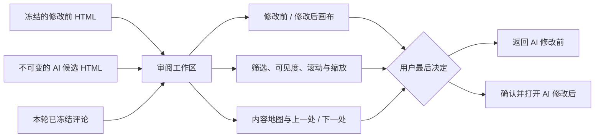
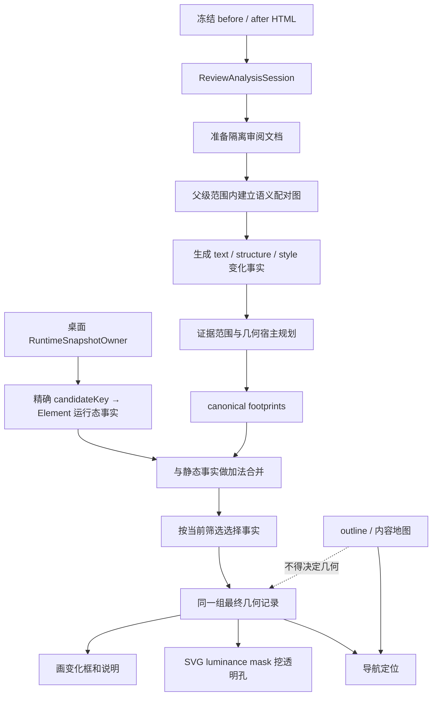

# AI 审阅对比：产品架构、产品逻辑与技术逻辑

> 适用版本：PageRoot `0.9.7`，基于 `main@37bba77`。本文解释已经合入的审阅修复：语义身份与变化事实对齐（#143）、遮罩透明孔按并集合并（#142）、运行态变化绑定到精确宿主（#144）。
>
> 本文是帮助产品、设计、测试和开发理解系统的“白话说明书”，不是一份新的行为规范。若细节与正式契约冲突，以 `INTERACTION_FLOW.md`、架构契约、安全模型和当前代码为准。

## 1. 先用一句话理解审阅对比

审阅对比不是第二个编辑器，而是一张临时、只读的“修改前后检查台”：

1. 它读取一份冻结的修改前 HTML 和一份不可变的 AI 候选 HTML。
2. 它先判断“什么真的变了”。
3. 再判断“这个变化应该画在哪个位置”。
4. 用同一组位置同时画框、挖开遮罩，并支持筛选和定位。
5. 最后由用户明确选择保留修改前版本，还是打开 AI 修改后版本。

在用户确认之前，审阅页不会改变当前项目源文件、当前版本或编辑画布。

## 2. 为什么这次修改是根本修复

原问题表面上有两种表现：

- 没有变化的大区域被框出来。
- 真正有变化的位置反而仍被遮罩压暗。

它们不是单纯的“框画歪了”，而是三种职责曾经容易混在一起：

| 职责 | 它回答的问题 | 现在由谁决定 |
| --- | --- | --- |
| 变化事实 | 到底变了什么 | 静态语义分析；桌面端可追加受限运行态证据 |
| 显示几何 | 框和透明孔应画在哪里 | 事实自己的精确几何宿主和最终 footprint |
| 导航归组 | 这处变化在内容地图中属于哪一块 | outline / 内容地图 |

现在的核心原则是：

> 内容地图可以告诉用户“去哪个章节看”，但不能替代变化事实，也不能决定画框范围。

因此，这次修复不是增加一批“遇到某种页面就特殊处理”的补丁，而是把身份、事实、几何和导航重新分开，并规定了唯一的数据流。

## 3. 先认识几个白话概念

| 名词 | 白话解释 | 类比 |
| --- | --- | --- |
| 修改前 / 修改后 | 本轮 AI 修改前的冻结 HTML / AI 返回且已通过校验的候选 HTML | 两份锁定的试卷 |
| 语义配对 | 判断前后哪个段落、列表项或卡片是“同一个东西” | 给两份名单中的同一个人配对 |
| 变化事实 | 已经确认的文案、结构或视觉变化 | 老师写下“这里改了标题” |
| 语义宿主 | 这项变化在内容意义上属于谁 | “这段文案属于第二张卡片” |
| 几何宿主 | 这项变化应该测量谁的矩形 | “边框变化要量整张卡片” |
| canonical footprint | 经过规划后，最终允许显示的一个或多个矩形 | 透明描图纸上的最终圈选范围 |
| 遮罩 | 压低未变化内容可见度的半透明白层 | 一张带透明窗口的磨砂纸 |
| outline | 内容地图和上一处/下一处使用的导航目录 | 书的目录 |
| 静态变化 | 直接从两份 HTML 的结构、文字和样式中证明的变化 | 对比两份纸面文件 |
| 运行态变化 | 脚本运行后，Canvas/SVG 等受支持宿主的最终画面变化 | 比较两台正在播放的屏幕 |

这里常说的“虚化”并不是把页面做高斯模糊，而是用白色遮罩降低未变化上下文的可见度。变化 footprint 对应的位置会在遮罩中挖成透明孔，所以变化内容保持清晰。

## 4. 产品架构：用户面对的是哪几个部分

从产品视角看，审阅由四层组成。

### 4.1 输入层：只接收冻结证据

审阅读取：

- 修改前的冻结 HTML。
- 已通过身份、Hash、路径和完整 HTML 校验的 AI 候选。
- 本轮开始前已经保存并冻结的评论。

它不把当前正在编辑的 DOM 当作事实，也不会一边审阅一边改写候选。

### 4.2 理解层：把差异变成用户能理解的变化

系统把变化分成三类：

- 文案：新增、删除、替换。
- 结构：元素新增、删除、移动或结构替换。
- 视觉：颜色、字体、背景、边框、尺寸、间距、定位、布局和换行等。

同一个元素可以同时有多项独立变化。例如一张卡片既换了背景，又改变了位置。这两项事实不会因为属于同一个 DOM 元素就被压成一项。

### 4.3 呈现层：让变化清晰，但保留必要上下文

呈现层负责：

- 左右两页显示修改前和修改后。
- 对变化位置画语义框和简短说明。
- 压低未变化区域的可见度。
- 保持所有当前筛选命中的变化清晰。
- 提供内容地图和上一处/下一处导航。
- 同步安全的 Tab、折叠和表单展示状态。

### 4.4 决策层：只有用户能采用候选

审阅本身没有激活或保存权。最终只有两个明确结果：

- “返回 AI 修改前”：不采用本次候选，继续以修改前版本为编辑基线；候选 HTML、版本、本轮记录和评论仍保留。
- “确认并打开 AI 修改后”：经过确认后，调用原有的候选激活安全链路，把候选变成当前打开版本。

从项目标识退出审阅，只是回到本轮处理页，不代表已经对候选作出选择。

## 5. 产品逻辑：用户进入审阅后会发生什么

### 5.1 什么时候可以进入

AI 候选通过检查并进入“待打开”状态后：

- 连续性正常时，显示“审阅对比”和“直接打开”，默认突出“审阅对比”。
- 连续性需要注意时，只允许先“审阅对比”，不允许绕过检查直接打开。

### 5.2 默认看到什么

默认组合是：

`双页 + 全部变化 + 上下文可见度 18% + 同步滚动 + 100%`

系统可以自动定位第一处变化，但“定位第一处”不等于“只显示第一处”。当前筛选命中的其他变化仍然保持清晰并显示边界。

### 5.3 六组控制互不越权

审阅状态被拆成六组互相独立的控制。某个按钮只能改变自己负责的那一项。

| 状态 | 用户能做什么 | 明确不会顺带做什么 |
| --- | --- | --- |
| 页面视图 `pageView` | 双页、只看修改前、只看修改后 | 不改变筛选、可见度或定位 |
| 变化筛选 `changeFilter` | 全部、文案、结构、视觉 | 不切换单双页，不替用户跳位置 |
| 上下文可见度 `contextVisibility` | 0–100 调整未变化内容清晰度 | 不选择变化，不打开 Tab |
| 导航目标 `navigationTarget` | 内容地图、上一处、下一处、当前说明 | 不重新判断变化，不重画另一套框 |
| 页面展示状态 `pagePresentationState` | 同步 Tab、折叠、业务按钮和表单值 | 不改变源 HTML 或版本 |
| 滚动与缩放 | 同步/独立滚动，适应/100% | 不关闭页面动作同步，不改变变化事实 |

这种拆分的产品价值是可预期：用户调“可见度”时，页面不会突然换筛选；用户点“下一处”时，其他变化不会莫名消失。

### 5.4 框选和遮罩的产品规则

产品层最重要的不变量是：

> 在同一侧、同一筛选、同一页面展示状态下，框和透明孔必须读取完全相同的一组最终 footprint。

因此：

- 有框的地方必须清晰。
- 被认定为变化但当前侧没有可见内容时，只保留不可见定位锚点，不能伪造一个框。
- 没有变化事实的大区域，即使它是章节、卡片或内容地图节点，也不能被框。
- 多个变化框重叠时，透明区域取并集，重叠位置仍然清晰。

### 5.5 文案变化如何显示

文案比较先确认具体哪些字、短语或句子发生了变化，再规划可读矩形。

- 纯新增：只在修改后页画新增内容；修改前页保留不可见定位锚点。
- 纯删除：只在修改前页画删除内容；修改后页保留不可见定位锚点。
- 局部替换：前后页分别框自己的变化短语。
- 跨行局部修改：每个实际文字行使用干净矩形，不画锯齿状大多边形。
- 密集段落改写：只有达到明确条件时，才提升为最小语义文本块。
- 稳定的前后句不会因为中间一句变化而被一起框入。
- 只改变 authored `br` 位置、正文不变时，显示为视觉类的“换行调整”，不是伪造红绿文字增删。

框边说明直接来自该项事实，例如“新增内容”“删除内容”“文本调整”“句子改写”“段落改写”或“换行调整”。

### 5.6 结构和视觉变化如何显示

结构变化遵循“最小能说明问题的结构单元”：

- 列表项变化优先框对应 `li`。
- 表格行变化优先框对应 `tr` 或受逻辑列约束的单元格。
- 新增或删除的结构不会自动再被重复判成视觉变化。

视觉变化按属性影响范围选择矩形：

- 文字颜色、字体等内容属性，使用细粒度内容框。
- 背景、边框、圆角、阴影、透明度、滤镜、尺寸、间距、定位和布局，使用对应元素的完整 border box。
- 祖先本身未变化、只有子元素变化时，祖先不能因为“包住了变化”而被框。

### 5.7 内容地图负责导航，不负责裁决

内容地图会同时列出已修改和未修改区域，方便用户理解页面结构。点击地图或上一处/下一处只会：

1. 安全地在两侧揭示目标所在 Tab。
2. 滚动到对应 footprint；当前侧没有 footprint 时滚动到不可见锚点。
3. 更新当前活动说明。

它不会改变页面视图、筛选、上下文可见度或缩放，也不会重新计算变化。

### 5.8 页面交互为什么能同步

审阅页允许在隔离环境中运行原页面的本地交互，以便检查真实展示状态：

- Tabs、折叠、普通业务按钮会在两侧安全同步。
- `input`、`select`、`textarea` 的值和选中态会镜像。
- 导航、表单提交、弹窗、下载和宿主 IPC 会被阻止。
- 用户在审阅中触发的运行态状态不会保存回 HTML 或版本。

如果前后两侧无法安全建立控件对应关系，系统保留当前侧结果并静默停止同步，不猜测另一个控件。

### 5.9 同步滚动为什么不容易“拉扯”

当前实际收到滚轮、触摸、指针或滚动键输入的一侧，是这一刻唯一的主控页。另一侧只跟随每帧最新目标：

- 用户换到另一侧操作时，旧侧尚未执行的跟随任务立即取消。
- 两页长度不同时，短页到边界只钳制短页，不把长页强拉到边界。
- Tab、字体或尺寸变化只标记映射过期，在手势空闲后重建。
- 独立滚动只关闭滚动跟随，不关闭 Tab 和控件同步。

### 5.10 评论如何显示

本轮冻结评论只显示在修改前页：

- 原目标位置显示一个 30px 紫色“评”标记。
- 悬停显示只读详情。
- 不提供编辑、回复或删除。
- 修改后页不重复显示。

评论正文始终留在可信 React 宿主层。评论定位和运行态截图是两套分离的私有能力，评论不能扩大运行态变化候选范围。

## 6. 技术架构：从两份 HTML 到用户看到的框

整条链路可以缩写为：

`冻结源码 → 语义配对 → 变化事实 → 几何 footprint → 过滤 → 同源框与遮罩`

桌面运行态证据只是在“变化事实”处做加法补充，不会替换或删除静态事实。

## 7. 技术逻辑第一步：怎样判断前后是同一个东西

这是防止“大区域误框”的第一道关。

### 7.1 三种信息各有不同用途

系统明确区分：

| 信息 | 能证明什么 | 不能证明什么 |
| --- | --- | --- |
| 稳定身份 `stableId` | 前后是同一个明确对象 | 不能单独证明内容没变 |
| 完全相等签名 `exactSignature` | 这个子树完全没变，可以跳过分析 | 不能因为顺序变化就认定发生“移动” |
| 自身兼容签名 `compatibilitySignature` | 两个空内容或原子单元在类型上可比较 | 不能把重复、歧义节点按位置硬配 |

可以把它们类比成：身份证、全身照片和职业类别。职业相同不等于同一个人；照片完全相同能说明这一刻看起来一样，但只有稳定身份证才能可靠证明移动的是谁。

### 7.2 配对只能在已配对父级内部进行

系统不会拿全页面所有 `div` 互相猜测。它先配对父级，再只比较该父级下同类型、同语境的兄弟单元。

这带来三个结果：

- 不同父级、不同单元类型或不兼容标签不会互配。
- 重复短句、重复类目或多个同分候选保持“未配对”，系统不靠 DOM 序号猜。
- 深层子元素变化不会让稳定祖先失去配对，也不会把祖先当成新增/删除的大块区域。

### 7.3 配对算法有明确预算

正常情况使用有界、保持顺序的兄弟配对；超出矩阵预算时使用有限前瞻的单调退化。它不会恢复成全页面笛卡尔积或贪心扫描。

这既限制了大文档的计算量，也避免为了“总要配上一个”而制造错误事实。

## 8. 技术逻辑第二步：怎样保存一项变化事实

每项事实至少包含：

- `type`：文案、结构或视觉。
- `id`：这项变化自己的标识。
- `semanticOwnerId`：内容意义上属于谁。
- `geometryOwnerId`：画框时量谁的矩形。
- 可选的 `operation`、`scope`、`tone`、说明等。

事实身份不是只有一个 `id`，而是由类型、事实 ID、语义宿主和几何宿主共同组成。这解决了两个关键问题：

1. 同一个元素上的背景变化和布局变化不会互相覆盖。
2. 同一个章节内不同子元素的变化不会因为 outline 相同而被合成外层大框。

可信分析在同一元素上出现第 25 项不同事实时会显式失败，而不是静默丢掉后面的事实、再把“不完整结果”冒充完整审阅。跨文档序列化输入同时受数量和 12,000 字节上限约束，异常数据按失败关闭处理。

## 9. 技术逻辑第三步：文字证据和画框范围为什么要分开

文字系统保存三类不同信息：

- `evidenceRanges`：证明哪些字符真的新增、删除或替换。
- `footprintGroups`：决定最终允许画哪些文字框。
- `anchorOffset`：当前侧没有可见内容时，只负责导航定位。

三者不能互相替代。

例如一句话只在修改后新增：

- 修改后有 evidence，也有 footprint，所以显示绿色框和透明孔。
- 修改前没有可框内容，只有 anchor，所以可以导航到上下文，但不会出现空框或透明孔。

可读范围规划会按标点、换行、稳定句和视觉行拆分范围。局部跨行修改使用多个干净行矩形；只有密集成对改写才可能提升为最小文本块，而且不能扩大到外层 card、section、article、form 或 table。

## 10. 技术逻辑第四步：框和遮罩怎样保证永远一致

这是防止“有变化却被压暗”的关键。

### 10.1 只计算一次最终几何

当前筛选下，系统先产出一组最终 canonical records。每条记录保存同一套 `renderFragments` 和路径数据。

- 画框读取这组记录。
- 遮罩透明孔也读取这组记录。
- 不能再从文字 marker、DOM 祖先或 outline 计算第二份范围。

所以不存在“一套算法说这里要框，另一套算法说这里仍该遮住”的合法状态。

### 10.2 遮罩使用集合并集，不使用奇偶抵消

每一侧的遮罩都是一个独立 SVG luminance mask：

1. 先铺满白色，表示整页都保留白色压暗层。
2. 每个最终 footprint 画成黑色路径，表示在这里挖透明孔。
3. 所有黑色孔天然取并集。

两个孔重叠时，重叠区仍然是黑色、仍然透明。旧式奇偶规则可能出现“挖两次等于补回去”的现象，当前实现明确不使用这种逻辑。

遮罩 ID 还包含会话、页面侧别、展示 epoch 和序号，避免两页或两次 Tab 状态切换误用同一个遮罩。

### 10.3 作者页面样式不能污染受管遮罩

系统给受管的 `svg`、`mask`、`path` 和 `rect` 原语写入高优先级重置值，防止用户页面中的通用 `svg path`、`rect` 或滤镜样式把遮罩改坏。

### 10.4 Tab 切换采用一次提交

Tab 或内容地图触发页面展示变化时：

1. 两侧先移除旧框和旧透明孔。
2. 临时按当前可见度压暗整页。
3. 等两侧 Tab 路径、DOM 尺寸和字体布局都稳定。
4. 在同一个 presentation epoch 一次性提交新框和新遮罩。

这样不会出现旧 Tab 的框穿透到新 Tab，或一侧先清晰、另一侧仍未更新。

## 11. 技术逻辑第五步：Canvas、SVG 等运行态变化怎样补充

普通静态 HTML 可以直接比较文字、结构和样式，但 Canvas 的像素通常由脚本画出来，单看源码不一定知道最终画面是否变化。因此桌面 Electron 审阅有一条受限补充链路。

### 11.1 先保静态审阅可用

两侧静态审阅一就绪，用户就能看。运行态截图异步追加，绝不阻塞静态结果。

### 11.2 只选择能从源码证明身份的宿主

`SourceHostResolver` 只接受：

- 直接的源码 `<canvas>`。
- 直接的源码 `<svg>`，包括其源码子节点。
- 自身源码为空、且拥有唯一稳定 `id`、`name`、`aria-label`、`data-*` 值或 class token 的宿主。

它不会解析 JavaScript、追踪 computed selector、借用评论范围、扫描任意运行态 DOM，也不会把 `tbody` 或普通大容器当万能候选。

### 11.3 可信 owner 在一次性沙箱中取证

主进程的 `RuntimeSnapshotOwner` 为每次请求创建：

- 隐藏且 sandboxed 的窗口。
- 非持久会话和独立 preview session。
- 被限制的相对资源访问。
- 对权限、导航、弹窗、下载、webview 和其他 URL 的拒绝策略。

owner 在作者脚本运行前复核源码路径、标签和身份，在 isolated world 中确认仍是同一个宿主；每个候选最多测一次 rect、截一张 PNG。总 deadline 为 1.5 秒，结果还要再次通过 PNG 头、尺寸、Hash、像素和总字节预算校验。

### 11.4 差异结果绑定回精确 Element

运行态比较只输出不透明的 `{candidateKey, changeId}`，不把截图交给审阅页。

每侧第一个 parser-blocking 的受管 bootstrap 在作者脚本前，私下把 `candidateKey` 绑定到“元素路径 + 完整窄 fingerprint”对应的原始 `Element`。可信父级再通过独立的随机 challenge 私有端口投递结果。

审阅页内部保存的是：

`Map<Element, ReviewProjectionFact[]>`

这意味着运行态事实直接属于那个精确元素，而不是属于一个章节标题或 outline 代表节点。元素被替换、断开连接或 fingerprint 漂移时，只丢弃该元素的运行态框，不回退到外层大区域。

### 11.5 运行态事实只能做加法

运行态 facts 与静态 facts 合并时遵循：

- 可以增加一个受证据支持的精确宿主变化。
- 不能删除、覆盖或降低静态事实。
- malformed、空、迟到、超时或截图失败时，保持纯静态审阅。
- outline 只能增加导航归组，不能决定运行态矩形。

当前只执行一组 before/after capture，不做第二次确认、重放、缓存或重试 UI。这一边界在第 15 节单独说明。

## 12. 状态归属：谁有权改什么

| 状态或能力 | 唯一 owner | 是否持久化 | 能否改变源 HTML |
| --- | --- | --- | --- |
| 页面、筛选、可见度、导航、展示、滚动、缩放 | `AiReviewWorkspace` reducer | 否 | 否 |
| 语义配对、变化事实、prepared documents、frame/mask geometry | `ReviewAnalysisSession` 与 analyzer | 仅有有界内存缓存 | 否 |
| 运行态窗口、会话、截图、deadline、清理 | Electron `RuntimeSnapshotOwner` | 否 | 否 |
| 精确运行态 Element 绑定和 facts map | 首个 review bootstrap | 否 | 否 |
| 冻结评论正文 | 可信 React 宿主 / ready-review session | 复用既有冻结证据 | 否 |
| 候选激活 | 既有 source-authority 激活链路 | 是 | 只有用户确认后可以 |

这张表的核心是：审阅画布只有“展示权”，没有“保存权”或“激活权”。

## 13. 安全逻辑：为什么运行原页面脚本仍不会接管应用

两侧审阅 iframe 只获得受限脚本能力：

- 没有同源权限。
- 不能提交表单、顶层导航、打开弹窗、下载或调用宿主 IPC。
- 嵌套 iframe 使用空 sandbox。
- 运行态截图只存在于可信 owner 和可信 renderer 内存中。
- `TargetRef`、PNG、候选绑定和评论正文不会进入作者 HTML。
- 运行态事实端口与评论端口使用不同命名空间、随机 challenge 和生命周期。
- 端口还要匹配 contract version、session、side 和完整 source SHA。

任何身份不符、数据不合法、目标被替换或能力不可用的情况，都选择“少显示一个补充框”，而不是猜测目标或扩大权限。

## 14. 三个完整例子

### 14.1 大卡片里只改了一句话

修改前和修改后都有同一张稳定卡片，只有第二段中的一句话变化。

1. 卡片通过稳定身份或高置信语义关系配对。
2. 完全相等的其他子树被跳过。
3. 第二段前后配对，文字 diff 证明具体短语变化。
4. 事实的语义宿主是该段落，几何宿主是对应文字范围。
5. 最终 footprint 只包含变化短语或对应文字行。
6. 框和透明孔读取同一 footprint。

结果：外层卡片和整章不会被框，真正变化的文字保持清晰。

### 14.2 脚本绘制的 Canvas 图表变化

两份 HTML 都有同一来源 Canvas，但图表由脚本绘制。

1. 静态审阅先完成，不等待截图。
2. `SourceHostResolver` 从源码证明前后 Canvas 是同一候选。
3. owner 在受限窗口分别运行两侧页面并截取该宿主。
4. PNG 不同后输出该候选的 `{candidateKey, changeId}`。
5. 首个 bootstrap 把 key 找回到两侧精确 Canvas `Element`。
6. 运行态视觉事实追加到该 Canvas，自身 border box 产生框和透明孔。

结果：框属于真正的 Canvas，不会因为它在“国内搜索趋势”章节里就把整章框起来。任何环节失败时，静态审阅照常存在。

### 14.3 卡片背景和卡内文字同时变化

同一张卡片既改了背景，也改了里面一句话。

1. 背景是 box-level 视觉事实，几何宿主是卡片。
2. 文字是独立文案事实，几何宿主是具体文字范围。
3. 两项事实不会因 DOM 宿主有关联而互相覆盖。
4. 两个框可以分别显示自己的说明。
5. 两个透明孔有重叠时按并集处理。

结果：用户既能看懂整张卡片的背景变化，也能看懂具体哪句话变化；重叠位置不会重新变暗。

## 15. 当前明确边界，不应误解为已经支持

当前方案主动保持以下边界：

- 纯浏览器或 inline/srcDoc 审阅只有静态分析，没有 Electron 运行态截图。
- 运行态候选只覆盖直接 Canvas/SVG 和可从源码唯一证明的 source-empty 稳定宿主。
- 不分析脚本因果，不猜测任意运行态 DOM，也不把评论范围当候选来源。
- 每轮只有一组 before/after capture，没有第二次确定性确认、重放、缓存或“重试截图”按钮。
- 动画、随机值、网络时序或超过 1.5 秒才完成的绘制，可能没有稳定运行态证据；系统会保留静态结果，而不是给出低置信猜测。
- 审阅不是像素级整页截图 diff。普通 HTML 的主事实仍来自语义和源码，运行态像素只补充受支持宿主。

这些不是允许绕过现有正确性的缺口，而是当前可信能力边界。如果未来要覆盖随机动画、异步数据图表或任意运行态 DOM，应作为独立 Runtime Observation v2 设计，重新定义确定性、性能、隐私和安全预算，不能在现有链路里悄悄加重试或全页截图。

## 16. 这三项修复分别解决了什么

| 已合入修改 | 根本改变 | 直接消除的错误类型 |
| --- | --- | --- |
| #143 语义身份与变化事实对齐 | 稳定身份、完全相等、兼容性分工；父级内有界配对；事实携带语义和几何宿主 | 稳定大区域被误判、重复节点错配、不同事实互相覆盖 |
| #142 遮罩孔并集合并 | 框和遮罩读取同一 canonical geometry；SVG luminance 黑孔取并集 | 有框位置仍被压暗、重叠孔奇偶抵消、作者样式污染遮罩 |
| #144 运行态事实绑定精确宿主 | candidate 逐一映射到脚本前捕获的原始 `Element`；outline 不参与 geometry | Canvas/SVG 真变化落到错误代表节点、外层章节被框、目标漂移后错误回退 |

三项合在一起形成闭环：

`配对不乱猜 → 事实不丢失 → 几何不借用导航 → 框与透明孔永远同源 → 运行态只追加精确证据`

## 17. 关键文件怎么分工

| 文件 | 主要职责 |
| --- | --- |
| `app/workbench/AiReviewWorkspace.tsx` | 产品状态、两侧 frame 协调、筛选导航、私有通道、运行态请求和 presentation epoch |
| `app/workbench/review-document.ts` | 准备审阅文档、静态分析、文字/结构/视觉 facts、几何测量、框、标签和遮罩 |
| `app/lib/review-semantic-alignment.js` | 父级范围内、有预算、保持顺序且拒绝歧义的语义配对 |
| `app/lib/review-text-diff.js` | 文字证据、相似度与范围分析 |
| `app/lib/review-projection-facts.js` | 事实校验、唯一身份、合并、筛选和溢出策略 |
| `app/lib/review-runtime-visual.js` | 比较可信运行态快照，把每个 changed candidate 合并进有效变化和 outline |
| `app/domain/runtime-snapshot-hosts.js` | 唯一的运行态源码宿主候选解析器 |
| `app/domain/runtime-visual-contract.js` | 运行态 contract、deadline、视口、PNG、像素和字节预算 |
| `app/lib/runtime-visual-snapshots.js` | PNG envelope、Hash、尺寸和预算的可信解析与验证 |
| `desktop/runtime-visual-capture-owner.mjs` | Electron 隐藏窗口、一次性会话、取证、deadline 和清理 |
| `desktop/preview-protocol.mjs` | 只向首个 parser-blocking bootstrap 提供私有绑定，后续退化为无绑定源码 |
| `app/lib/review-scroll-sync.js` | 双页主控手势、语义滚动映射和边界钳制 |
| `app/lib/page-presentation-dom.ts` | Tabs、panel、业务按钮和控件的安全对应 |

正式契约主要位于：

- `docs/INTERACTION_FLOW.md`
- `docs/ARCHITECTURE.md`
- `docs/ARCHITECTURE_CONTRACT.md`
- `docs/STATE_OWNERSHIP.md`
- `docs/SECURITY_MODEL.md`
- `docs/RUNTIME_VISUAL_CONTRACT.md`

## 18. 测试在证明什么

| 测试区域 | 主要证明 |
| --- | --- |
| `tests/review-semantic-alignment.test.mjs` | 稳定身份、重复歧义、空宿主兼容性、移动身份和大列表预算 |
| `tests/review-projection-facts.test.mjs` | 多事实共存、事实身份、筛选、溢出和失败关闭 |
| `tests/review-runtime-visual.test.mjs` | 每个 candidate 都保留自己的 change 映射，outline 不吞几何 |
| `tests/e2e/browser/native-dom-runtime-projection-binding.spec.mjs` | 私有 key 绑定到精确原始 Element；替换、断连、漂移和恶意消息失败关闭 |
| `tests/e2e/electron/ai-handoff-closed-loop.spec.mjs` | 正式审阅流程、框/遮罩同源、重叠孔并集、评论、交互和候选决策闭环 |
| Runtime owner / contract 单元测试 | 源码身份、sandbox、PNG 预算、deadline、cleanup 和静态优先 |

开发时的总入口仍是 `npm run gate:edit`；本文不新建第二套测试命令或验收标准。

## 19. 给小白的最终记忆法

只要记住下面五句话，就能判断审阅行为是否正确：

1. 先认清前后是不是同一个对象，再谈它变了什么。
2. “变化事实”“画框位置”“内容地图归组”是三件事。
3. 框和透明孔必须来自同一份最终 footprint。
4. 运行态截图只能补充精确宿主，不能覆盖静态事实，也不能拿章节代替元素。
5. 审阅只负责看和选；用户确认前，它永远不能修改项目源。

用更短的一行表示就是：

> 事实决定该不该显示，几何决定显示在哪里，导航只负责带用户过去，用户决定是否采用。
