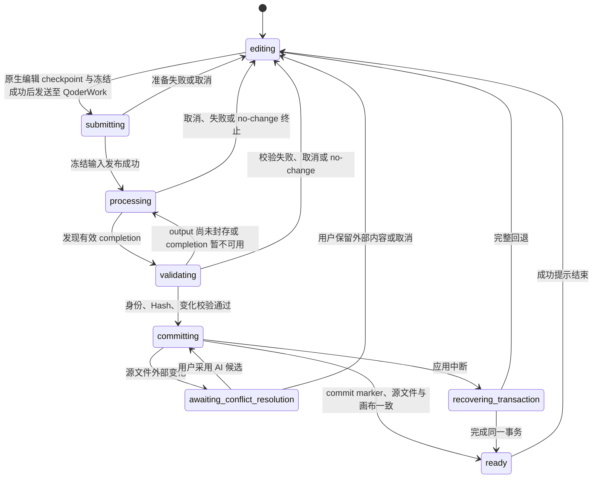

# PageRoot 交互流程

- 状态：v3 源码级定点修改目标交互合同
- 上位文档：[架构说明](ARCHITECTURE.md)
- 安全边界：[安全模型](SECURITY_MODEL.md)
- 产品范围：[MVP 产品需求](MVP_PRD.md)
- 文件协议：[Change Request 协议](CHANGE_REQUEST_PROTOCOL.md)

本文只描述目标流程。旧 0.5.x 中“手动保存建版”“稳定 HTML 自动完成”“恢复历史时复制为新版”“处理时锁住全部项目”等行为均不属于目标交互。

## 1. 用户心智模型

用户只需要理解三件事：

1. 我在当前 HTML 上直接编辑，系统自动更新文件。
2. 我把当前内容和评论冻结后发送至 QoderWork；只有冻结成功，当前项目才会锁住。
3. 内部 AI 真正完成且产生有效变化后，系统会新建下一份 HTML 并切换过去，不会覆盖我提交前的文件。
4. 修改前完整 HTML、修改后新工作文件和不可变历史 HTML 都会保留。

页面不要求用户区分临时文件、写入队列、事务目录或 commit marker；但所有状态文案必须反映这些底层事实。

## 2. 顶层导航

工作台包含：

- 当前项目入口。
- 当前文件名、版本与保存状态；文件名右侧常驻粗体“+”和斜向右上的外部打开图标，分别用于快速“打开本地HTML”和“在默认浏览器中打开”当前已知源文件。两者在鼠标悬浮或键盘聚焦时于图标右上方显示小号浅色浮层提示，不参与顶部栏布局计算；外部打开会先围栏刚送达的原生输入并等待该精确编辑 revision 安全写回，写回中保持禁用，失败时不启动浏览器。纯浏览器预览没有本地文件权限，因此仅展示禁用态的外部打开图标。桌面本地文件在安全保存时还可从文件名原位重命名，并提供“在文件夹中打开”快捷入口。
- “已安全保存”不仅表示写盘完成：当前视图必须是可编辑的当前 HTML，编辑 revision 已持久化，并且眼前的编辑或预览画布已用当前 Canvas generation 回报同一源 Hash。切换视图或重建画布的短暂窗口显示“正在确认当前画布…”，不得沿用旧画布的成功状态。
- 顶部栏为两行文件信息、编辑/预览、项目、全局评论与发送按钮保留完整垂直空间；HTML 图标是“关于源页”的入口。图标在无更新、`New!` 和 `New! 重启更新` 三种状态中始终使用同一几何中心，不因预留标签而上移。存在更新时，较小的标签以绝对定位局部叠在图标下缘，点击语义仍是下载或重启确认；图标、标签、标题、快捷操作和焦点轮廓都不得互相遮挡或越过底部分隔线。
- 当前 HTML 画布。
- 直接编辑工具。
- 评论与本轮要求面板。
- 自动写回状态。
- “一键发送至 QoderWork”主按钮。
- macOS 应用菜单中的“关于源页”入口；弹层以简洁文案说明本地 HTML 与 AI Agent 协作定位，展示当前版本和运行架构，提供“检查更新”、GitHub 仓库和“用户声明与免责声明”入口，并把检查中、已是最新、等待下载、下载中、可以重启或失败原因原位展示。声明入口只打开安装包内随附的固定本地文本文件，不接受页面传入路径。
- 仅在正式签名的 macOS App 检测到 stable 新版本后，于发送按钮上方显示右对齐的红色斜体 `New!`；点击后才静默下载，下载期间不显示百分比或动效。下载完成后弹出“现在重启 / 稍后”确认；选择稍后时入口变为 `New! 重启更新`，再次点击打开同一确认。Canvas 不显示下载完成横幅，顶部也不新增图标。应用在启动约 5 秒后及持续打开期间每 4 小时检查 stable 更新，安装前仍执行同一套安全写入与关闭确认。
- 项目文件与交接详情。
- 版本历史。

“项目资料”使用用户语言解释：

- `PROJECT.md`：整个项目以后每次 AI 修改都会使用的长期规则；项目空闲时可修改，处理时只查看。
- `runtime-state.json`：系统记录项目当前是否在处理、锁定或恢复；只查看。
- `edit-audit.jsonl`：系统记录本地直接编辑的时间、位置和修改前后内容；只查看。

项目面板展开“项目资料”时自动准备项目记录，不要求用户先发送一次 AI 任务。入口分为“项目长期规则”和“项目记录文件夹”：前者说明以后每次 AI 修改都会读取，后者说明可在 Finder 查看每轮要求、AI 返回与历史文件。Finder 中的项目文件夹固定使用 `<HTML 文件名>__<项目创建时间>__<短项目标识>`，不直接显示完整 UUID；HTML 后续改名或移动不重命名项目记录文件夹。规则读取完成前不可编辑；未保存时离开或切换项目会被阻止，并明确要求保存或还原。中文输入法处于组词阶段时暂停规则自动保存；用户明确“还原修改”时先废弃持有 marked text 的旧输入框，再恢复已保存内容，迟到的 composition/input 不能把拼音写回。

只打开顶部“项目”面板不登记项目。若项目资料建立失败，失败原因和“重试建立”留在展开区域；若 `PROJECT.md` 读取失败，编辑器不使用占位文案冒充文件内容，用户可以重试读取或返回项目。

文件菜单提供：

- 打开本地 HTML。
- 最近打开。
- 导出 HTML 副本。

主界面、文件菜单、原生菜单和右键菜单均不提供独立的“保存为 Version”动作。

## 3. 项目级状态机



状态含义：

| 状态 | 当前项目 | 允许动作 |
|---|---|---|
| `editing` | 可编辑 | 直接编辑、评论、提交、历史查看/恢复、导出；安全保存时重命名当前文件 |
| `submitting` | 已锁定 | 被动查看冻结页面与状态、取消、切换其他项目 |
| `processing` | 已锁定 | 被动查看冻结页面与状态、取消、切换其他项目 |
| `validating` | 已锁定 | 查看校验进度、取消、切换其他项目 |
| `committing` | 已锁定 | 查看提交进度、切换其他项目 |
| `ready` | 已解锁 | 查看本轮变化、开始下一轮 |
| `awaiting-conflict-resolution` | 已锁定 | 比较、采用 AI、保留外部、取消、切换其他项目 |
| `recovering-transaction` | 已锁定 | 查看恢复进度、切换其他项目 |

锁只属于一个 `projectId`。处理 A 项目时，用户仍能打开、切换和编辑 B 项目。

### 3.1 首次启动欢迎项目

桌面应用没有可恢复的当前项目时，不显示一个只有内存内容的假预览。系统会在所选工作区的上级目录建立 `欢迎来到源页.html`；默认位置是 `~/Documents/PageRoot/欢迎来到源页.html`，并立即：

1. 把它作为普通当前 HTML 加入最近项目。
2. 通过 Bridge 登记独立的 `projectId`、`documentId` 和初始 V1。
3. 按与用户打开 HTML 相同的源码写回、评论、附件、Request、QoderWork 交接和版本流程运行。

欢迎 HTML 只在文件不存在时写入；模板以用户语言介绍直接编辑、AI Agent 交接和“修改前后对照、审阅后再决定”的结果流程，并用与正式审阅界面一致的文案、结构、视觉变化语义展示双页示意。模板引用的 `brand-logo.png` 同时以受管普通文件写到 HTML 同级目录，桌面首次打开不得显示断图。用户对欢迎 HTML 的修改、AI 新版和项目记录在重启后继续保留，应用不得用内置模板覆盖。已有当前项目时仍优先恢复该项目，不额外创建或切换欢迎项目。纯浏览器预览没有桌面文件权限，继续使用只存在于内存中的欢迎内容和公开品牌图。

正式签名 App 首次访问 `Documents` 时，macOS 权限确认可以暂停本地工作区
服务启动。只要服务进程仍在运行，系统保持同一次启动并等待其明确 `ready`；
用户完成权限选择后自动继续打开工作台，不显示“启动超时”、不要求重启，
也不把尚未就绪的端口交给 Renderer。只有服务在 `ready` 前真实退出或报告
启动错误时，才进入原生启动失败流程。

### 3.2 纯浏览器预览

纯浏览器预览是正式产品能力，但边界固定为只读：

- 默认进入“预览”，不能切换到“编辑”。
- PageRoot 的直接编辑、评论、附件、项目持久化和“发送至 Qoder”均不可用。
- 页面自身的脚本、表单与交互可以在 sandbox 内运行；顶部持续显示“浏览器预览 · 只读”“操作不会保存”。
- 离开预览不弹“是否保存”，因为 PageRoot 从未接受可写修改。

### 3.3 桌面交互预览与“编辑当前页面”

桌面版仍只有“编辑 / 预览”两种模式，不增加分屏或第三种模式：

1. 用户停留在“编辑”时，桌面端会自动为源码中为空、但被页面脚本填充的
   图表宿主生成一次只读 PNG 投影，不要求先进入预览。直接作为空源码宿主的
   Canvas/SVG、
   运行时 SVG/HTML 图表和动态 `tbody` 统一走同一截图协议，不对 ECharts
   或其他图表库写适配器。普通宿主按 content box、`tbody` 按 border box
   捕获；协议传输有界 PNG 二进制并校验内容摘要、像素尺寸、DPR 和裁剪几何。
   包含 border/padding/transform 时仍只让编辑文档应用一次原布局变换。
   被视口或祖先 overflow 截断的结果不会放大填充，隐藏宿主暂缓本次替换。
2. 点击“预览”后，当前 HTML 在独立隔离文档中像普通页面一样运行。
   页面脚本、相对资源、Tab、表单、SVG、Canvas 和动态表格可以工作；
   页面不能导航宿主窗口或获得 PageRoot 的文件、编辑、评论和 AI 权限。
3. 用户在预览中切换 Tab、展开详情或改变同类显示状态。
4. 点击“编辑”时，系统无额外提示地采集一次有限页面上下文；不要求用户
   再点按钮，也不根据预览滚动位置定位编辑画布。
5. 编辑器继续从当前权威源码构建禁用脚本的画布，只把仍能唯一映射到
   源码节点的 Tab/显示状态临时应用到画面，因此用户看到并编辑刚才选择
   的页面。该临时状态不写回 HTML。

运行时图表投影以脚本/样式、脚本引用的数据容器、稳定宿主 TargetRef、
64px 视口 bucket 和页面显示状态作为刷新依赖。普通文字输入、撤销/重做或不改变这些依赖的源码位移只把已验证位图
重新绑定到当前精确 SourceIndex，不重新运行截图；编辑/预览切换保留有界的
最近结果；缓存同时受条目数和总字节数约束。普通宿主的位图放在响应式
content-layer 中，以 `contain` 保持比例并跟随宿主流式布局/ResizeObserver；
直接 Canvas/SVG 使用可逆的 content-box 背景适配。确需刷新时旧图继续显示，
新的 Blob PNG 离屏解码成功后再原位替换，因此内部重新计算不先清空画布，
也不增加任何提示或操作入口。

编辑画布继续复用既有的链接、按钮、表单、输入与键盘默认行为拦截，
保留单击选择和双击文字编辑；不增加全页 `inert` 或另一套通用事件层。
运行时新增节点、图表 Tooltip、动态表格行、Canvas 像素、脚本改写文字、
表单值和滚动位置不会进入编辑 DOM，也不会冒充可编辑源码。
只读图像是一个 `pointer-events: none` 的前端假元素：用户点击、选中和留评论
时命中的仍是原 HTML 中的空宿主，修改要求也绑定该宿主的 TargetRef。
投影不可点击交互，页面真实交互仍使用“预览”。

保存、导出、撤销/重做、版本对比和发给 AI 的基础文件始终是完整、原样的
权威 HTML。PageRoot 只不额外加入投影 PNG、临时 URL、假元素、运行时
SVG/HTML 或 `data-pageroot-*` 属性；不对原 HTML 自身做删减。审阅/版本页不复用
编辑态 PNG 投影，仍以冻结原 HTML 做静态对比；仅对静态 footprint 尚未覆盖、
能唯一配对且由本轮脚本变化填充的空图表宿主，在现有隔离审阅页内补充一次
稳定 HTML/SVG/Canvas 视觉指纹。普通宿主仍要求变化脚本直接引用其稳定身份；
若宿主本身或祖先是本轮非全局评论的冻结目标，则该局部用户意图可让宿主优先
进入同一有界指纹比对；系统还在同一高置信度审阅 section 内，从评论目标向上寻找
首个至少包含两个可配对空图表的祖先组，并依次纳入该组中的相邻图表。这样无需解析
评论正文，也能覆盖配色、数据或配置脚本与图表绑定脚本分离的 A+B 场景。
最近组只使用每个 section 一次预计算的源码 DOM 祖先计数，不读取布局或增加网络请求。

### 3.4 编辑模式中的安全内容切换

编辑模式不需要为了查看同一 HTML 中的其他静态内容而切到预览，但也不
恢复页面的任意脚本行为：

1. 普通单击继续只选择元素并显示选框；第二次普通单击仍然只是选择，
   不和浏览器的 `dblclick` 判定争抢。双击继续进入既有文字编辑路径。
2. 当选中项能被源码唯一证明为语义完整的 Tab、原生
   `details/summary`，或相邻的本地 disclosure 区时，选框工具条显示一个
   明确动作，例如“切换到此页签”“展开内容”或“收起内容”。
3. 动作按钮始终显示完整文案；`⌥` 快捷提示不占工具条常驻空间，只在
   鼠标悬停该动作按钮时通过提示显示。键盘用户可以正常聚焦并执行动作。
4. `Option + 单击` 页面中的同一控件执行相同动作。一次
   `Option + 双击` 最多执行一次切换，并且不会同时进入文字编辑。
5. “当前页签”保留稳定按钮和焦点，但再次执行不产生变化。

直接切换只接受无需作者脚本即可确定的源码语义：

- Tab 必须属于 `role=tablist`，每个 `role=tab` 以唯一
  `aria-controls`（或本页锚点）对应唯一 `role=tabpanel`，并且
  `aria-selected` 与 `hidden` 状态一致。
- 兼容报告中常见的旧式页签时，只接受同一父级内的 `button` / `div`
  控件以同一种 `data-p` 或 `data-tab` 明确映射到唯一面板 ID；控件组和
  面板组各自必须拥有一致的公共 class、数量一一对应，并且只有同一序号
  的控件和面板带 `active`。动作只转移这一个 `active` class；映射重复、
  混用属性、公共结构不一致或出现多个激活项时全部保持无动作。
- 对导出报告常见的固定索引页签，还可把形式严格为同一个标识符加一个
  十进制常量参数的 `onclick`（例如 `switchChart(0)`）仅作为结构证据：
  同父级 `button` / `div` / `li` 控件必须使用连续的 0 起始或 1 起始序号，
  拥有一致的非空公共 class，并且附近只能找到一组数量、标签和公共 class
  一致的内容面板。控件与面板各自恰有一个相同序号的 `active` 项时，动作
  只转移这一个 class；处理器名称混用、序号重复或跳号、多语句、动态参数、
  多组候选面板及多激活项全部保持无动作。处理器文字永远不会被求值或执行。
- `details` 必须拥有唯一直接 `summary`；首版不接管带 `name` 的互斥
  details 组。
- disclosure 必须是本地按钮与紧邻 region 的一对，使用唯一
  `aria-controls` / `aria-labelledby`，且 `aria-expanded` 与 `hidden`
  一致。

普通 Hyperlink、表单提交、任意多语句或动态 `onclick`、没有上述可唯一
证明关系而仅靠视觉 class、序号或运行时脚本识别的 Tab、弹窗、Popover
和抽屉均不执行；它们不会展开新的源码可编辑内容，需要真实运行时仍使用
“预览”。安全内容切换只更新 Workbench 已有的 `PageViewContext`，不产生
SourcePatch、不写磁盘、不运行作者脚本，也不引入右键菜单、第三种模式或
第二套页面运行状态。执行这个显示切换时保留共享正文滚动位置；只有用户
从评论卡片等定位入口明确前往目标时才允许滚动页面。

源码静态回退仍是最可编辑、最易对比的首选：图表优先内联 SVG，表格行
优先直接写入静态 HTML。但对已有的脚本生成报告，编辑模式可用上述统一
只读截图显示视觉结果，不再要求每个图表库或页面都另写兼容补丁。

## 4. 打开已有 HTML

除首次启动时建立受管欢迎项目外，工作台不负责创建业务 HTML；用户打开已经由其他工具生成的本地 `.html` 文件。

在 macOS 或 QoderWork 的“打开方式”中选择 PageRoot 时，系统只接受绝对
路径的 `.html` / `.htm` 文件，并在应用未启动或已运行时打开同一份当前源文件。
它与“打开本地 HTML”共用安全项目切换边界和主进程完整打开队列：当前编辑、
评论、附件和项目规则会先安全收口，无法收口时保留当前项目；本地选择、最近
项目和外部文件在开始选择、读取或校验前便确定同一顺序。连续发来的外部打开
请求按顺序处理，尚未开始的旧请求由最新请求取代；较慢的旧读取也不能反向覆盖
最终显示、活动文件或最近项目。外部文件在主进程接受请求期间继续冻结已经安全
收口的画布；若最后一道边界捕获到新的原生输入，则不发起外部接受，先按正常
自动写回后再重试切换；进入延后状态只记录一次新的安全切换转换，已经观察到的
阻塞条件解除后才自动重试。若没有可观察的阻塞条件，系统保留当前 HTML 并提供
“重试打开”由用户明确发起，避免在画布恢复异常时循环重试。主进程已经接受的
本地或外部结果还会进入渲染器 FIFO；每一项在真正替换画面前都会再次安全收口并
同步冻结当前画布。因此先完成的 A 与仍在读取的 B 不会让 B 覆盖用户随后在 A 上
产生但尚未安全处理的编辑。失效请求、移动后的文件或非 HTML 文件只报告失败，绝不
改变当前 HTML；若较新的外部请求失败，页面保留此前已成功打开的 HTML，而不会
退回到更早的页面或与活动文件记录分离。关闭、重启或更新的安全确认尚未提交时，
新外部打开会取消本次关闭并继续按上述切换流程处理；确认已经提交后，当前进程不再
接收该请求，而是把最新已验证路径交给下一次启动，避免退出中的项目记录与画面脱节。

当前文件名右侧始终保留独立的“+”按钮，点击后与文件菜单“打开本地 HTML”共用同一文件选择与项目切换流程。标题的小铅笔仍只在鼠标悬停或键盘聚焦时出现；两个入口的点击热区互不嵌套。若当前编辑、评论、附件或项目规则还没有安全收口，系统先沿用项目切换边界完成保存或阻止切换，用户取消文件选择时继续停留在当前 HTML。

1. 用户选择本地 HTML。
2. 系统优先按持久 `documentId` 重新绑定；无法识别时创建新 Document。
3. 若是新 Document，仅以未登记只读状态打开；第一次真实编辑、添加附件、发送给 QoderWork，或用户明确展开“项目资料”时才登记项目与初始 V1。
4. 通过 registry 中的 `storageDirectoryName` 定位项目文件夹，再读取该项目自己的 `project.json` 与 `runtime-state.json`。
5. 对照项目当前 `sourcePath` 指向的 HTML、latest committed Version 和运行时 Hash。旧原始路径或旧工作路径打开时，通过 registry 别名回到同一项目的最新 canonical path。
6. 按项目状态恢复：editing 时可恢复 current 或精确历史查看；存在 active run 时强制显示该轮冻结 current 页面，并默认展开“本轮处理”面板说明正在等待 AI 返回；冲突时显示该候选对比，事务恢复时显示恢复进度。用户主动收起处理面板后可以只读浏览冻结页面，直到再次打开或切回该项目前都不自动弹回。

不得通过扫描所有 `requests/`、取最新修改时间或猜测“哪个目录像处理中”来恢复状态。

### 4.1 顶部原位重命名

桌面版当前 HTML 满足以下条件时，顶部文件名才提供重命名：

- 当前项目处于 `editing`，没有 AI 处理、冲突、历史查看或页面切换。
- 自动写回为 `idle`，且 `editRevision=lastPersistedRevision`。
- 当前文件存在、Hash 与工作台已知值一致，Bridge 与桌面文件服务可用。

文件名平时保持普通标题外观；鼠标悬停或键盘聚焦时显示克制的编辑图标。用户双击文件名进入原位输入，也可在标题聚焦后按 `Enter` 或 `F2`。输入框只编辑主文件名，现有 `.html` / `.htm` 后缀以弱化文字固定显示，不允许改变目录。`Enter` 或失焦提交，`Escape` 取消。

提交重命名前，系统按项目切换同等边界收口原生文字输入、源 HTML 自动写回、评论/审计、附件与项目规则。任何一项仍未安全完成就留在输入框原位说明，不启动文件系统操作。

重命名事务顺序：

```text
稳定 operationId + 当前 sourcePath + 预期源 Hash
→ 在桌面活动文件记录写入 pendingRename
→ 确认目标同目录、同后缀且没有同名文件
→ 以独占硬链接占位并复核 inode/Hash
→ 删除旧路径；竞态时回滚且绝不覆盖目标文件
→ 把 active/recent 路径切换到新位置并写入 lastRename
→ Bridge 按物理文件身份重绑同一 projectId/documentId
→ Renderer 用新 sourcePath 刷新同一项目会话
```

同名目标已存在、名称非法、权限不足或 Hash 已变化时，旧文件与目标文件都保持不变，错误贴在文件名输入框下方，不弹全局 Toast。成功只把持续状态短暂改为“正在重命名…”，随后恢复“已安全保存”。

若应用在 `pendingRename` 写入后意外退出，下次启动根据旧、新路径和预期 Hash 完成或确认同一操作，再更新活动/最近记录。Bridge 通过文件物理身份重绑并同步 `project.json.name`；不得因为文件名变化创建新 Project、Document 或 Version。用户在 Finder 中自行移动或改名时仍沿用相同身份重绑规则，但运行中的工作台不通过猜测自动切换路径。

## 5. 直接编辑与自动写回

### 5.1 普通编辑

画布编辑区上方固定显示：

```text
本地文本编辑会直接修改源文件并保存
```

这里的源文件是项目当前指向的 HTML。首次打开时是用户选择的原始文件；第一次 AI 成功后是 `working/V1.1.html`，下一次是 `working/V1.2.html`。

每次编辑的交互顺序：

```text
单击选择文字宿主
→ 双击并把光标放到点击位置
→ IslandEditingController 建立一个与精确源码 contentRange 对应的可编辑岛
→ 浏览器提供光标 / Selection / IME，Controller 接管所有实际文字变更
→ 用户输入、删除或选择文字
→ 约 700ms 或格式、Cmd+S、目标切换、关闭、发送边界
→ 生成 replace-editable-island EditCommand
→ SourceIndex + TargetResolver 锁定源码范围
→ 岛内做最小安全规范化，SourcePatchEngine 生成精确 contentRange patch 与 inverse patch
→ 校验岛外字节完全不变，并重解析受影响区域
→ 用新源码原子重建 projection 并恢复逻辑选区
→ 内存 source HTML 立即更新
→ editRevision + 1
→ 记录 edit event
→ 顶部显示“正在更新…”
→ debounce 后进入同一串行队列
→ 核对源 Hash
→ 临时文件写入、刷盘、原子替换
→ 重读校验
→ lastPersistedRevision 前移
→ 显示“已更新到文件 · 时间”
```

连续快速编辑时：

- 旧 revision 的写入可以完成，但不得把新内存内容回滚。
- 队列继续处理最新 revision，直至 `lastPersistedRevision=editRevision`。
- UI 只在最后成功落盘后显示“已更新”。
- 画布 DOM 只用于预览和采集用户意图；不得把 `documentElement.outerHTML` 或整页 DOM 序列化结果写回源文件。
- `contenteditable`、IME 快照、运行时 nodeId 和逻辑选区只存在于当前会话；不能保存为第二份 HTML 或长期 JSON。
- flex/grid 文字只有在源码、运行时布局和 CSS selector 均安全时，才随首个真实 Patch 创建唯一 canonical 直接文字项；双击本身不修改源码。
- 任何目标为 `ambiguous`、`orphaned`，或 patch 越出已解析源码范围时都必须 fail-closed，保留当前源码并要求用户重新定位。

PageRoot 0.9.0 只使用一种文字编辑路线：

- 可编辑岛统一使用受控 `contenteditable="true"`。浏览器只负责焦点、光标、Selection 与 composition；普通输入、删除、换行、剪切和粘贴由 Controller 阻止默认行为后按逻辑位置执行。粘贴只读取 `text/plain`，换行固定写成 `<br>`。
- 可视段首、段尾、行中和非空行内样式交界都必须支持输入与删除。可视段首继承右侧首字符，其余边界统一继承左侧字符；工具栏显示下一次输入将采用的样式。
- 整个岛在一次会话内保持打开；工具栏内部及与当前选区绑定的评论操作不会结束编辑。用户点击除此之外的页面内容或 App 区域时，系统提交当前 checkpoint，并一次性清除 `contenteditable`、选区和浮动工具栏。Escape、保存、导出、项目切换、关闭和发送同样是明确 checkpoint 边界。
- IME 开始时冻结岛内容与逻辑 Selection；结束时恢复快照，并把最终候选文字只插入冻结位置一次。没有完成的 composition 在失焦时取消，不猜测候选结果。
- `MutationObserver` 只允许 Controller 自己发起的子节点和文字变更；脚本、浏览器命令或页面事件造成的越权 DOM 变化立即恢复到最近一次安全草稿，并在当前视口提示。
- 岛可以包含安全行内语义、注释以及不可变的图片、SVG、MathML、Canvas、表单控件或媒体原子；这些原子及其属性不能被文字操作改写。脚本、样式、表单根、嵌入文档根及无法形成安全行内岛的块结构仍转为评论。
- 保存时只替换所选元素的源码内容范围。未编辑区域逐字节保持；编辑岛允许 parse5 为结构安全做最小规范化，但不得增加受保护属性、改变不可变原子或注释。

### 5.2 撤销与重做

不增加新的画布工具栏按钮，直接复用 macOS `Edit` 菜单：

```text
画布或画布编辑岛拥有焦点
→ Cmd/Ctrl+Z，或 Edit > Undo
→ 完成当前 IME / 文字 checkpoint
→ 刷新同一条自动写回队列，确认没有待落盘 Patch
→ 用历史 cursor 选择上一条 exact inverse Patch
→ Bridge 核对 projectId + documentId + source Hash + history revision
→ HTML 与 source-operations.json 进入同一个 pendingWrite 恢复边界
→ 原子替换并重读源 HTML
→ 画布采用 Bridge 返回的 canonical bytes
→ 沿同一历史操作迁移 TargetRef
→ 若变化严格局限于同一个可编辑文字岛，则在当前 iframe 原位采用并恢复宿主、逻辑选区与视口
→ 其余情况只重建一次 verified iframe，再恢复宿主、逻辑选区与视口
```

重做使用 `Cmd/Ctrl+Shift+Z`、Windows/Linux 的 `Ctrl+Y` 或
`Edit > Redo`，沿相同链路应用原 forward Patch。文字、样式、安全的
岛内结构变化和同级模块上移/下移均进入这条历史；关闭并重开项目后，
最多最近 100 个且合计不超过 32 MiB 的连续操作仍可使用。撤销/重做
本身增加 edit revision 和审计记录，但不创建 Version。

新的画布修改会丢弃 cursor 之后的 redo。源文件被外部程序改写、切换到
新的 AI 工作文件，或任一 Hash 链无法连续证明时，系统从当前字节建立
新的历史边界，不尝试跨边界套用旧 Patch。请求结果未知时先读取 Bridge
权威历史；只有 action 已登记或原前提仍成立，才用同一 action ID 重放
一次。

文字操作的历史记录可以携带前后逻辑 Selection；它只用于 canonical
采用后恢复焦点、方向和光标，不参与生成源码。Bridge 确认结果后，只有
前后 TargetRef 都能沿历史迁移精确解析到对应编辑岛、源码前后缀证明所有
岛外字节未变，且
整份挂载源码节点映射仍与新 SourceIndex 一致时，Canvas 才替换当前宿主的
canonical 子节点而不更换 iframe；任何证明失败都回退到 fresh-frame 重建。
旧 Canvas 被围栏后不先做一次中间重建，快速路径全程保持 verified 与原视口，
回退路径也只替换一次。若同一源码元素上的评论与编辑
操作使用不同 target ID，则以前后 TargetRef 作为身份桥迁移评论锚点；
新 Canvas 尚未上报几何的短暂窗口继续使用上一帧已确认位置，不把它显示成
“原位置已变化”或把评论卡片排到右栏底部。真正无法解析的目标仍保持
`ambiguous` / `orphaned`，不会被这条迁移规则掩盖。

已登记项目的每一次写操作在用户意图开始时一次性冻结
`projectId + documentId + sourcePath`；附件上传及其失败清理也使用同一份
上下文。Bridge 先按两个 ID 找到原项目，再把路径当作归属校验；
已登记写操作不能因路径或 inode 变化而新建项目。PageRoot 原子替换完源文件、
但 registry 尚未刷新的窄窗口，只由原项目 `pendingWrite` 的目标 Hash
证明并原位恢复；其他物理替换仍按外部变更停止写入。

焦点位于评论正文、项目长期规则、文件名或其他真实文字输入框时，
Edit 菜单与快捷键只调用该控件的原生局部撤销，不进入源码历史。
评论卡片、评论/附件的新增删除以及其他项目操作不提供产品级撤销。

### 5.3 `Cmd+S`

`Cmd+S`：

1. 取消当前 debounce 等待。
2. 将最新 revision 送入同一队列。
3. 等待或反馈这次 flush 的真实结果。

它不创建额外事件、不改变 Version、不打开系统另存对话框。

### 5.4 写入失败

显示：

```text
更新失败 · 当前修改仍保留
[导出当前编辑内容]
```

同时：

- 保留内存内容。
- 保留短期恢复日志。
- 禁用“一键发送至 QoderWork”。
- 项目切换或关闭前要求用户处理，不静默丢失。

### 5.5 外部修改

写入前 Hash 不等于预期时显示：

```text
检测到文件被其他程序修改
[重新载入外部文件] [导出当前编辑内容]
```

在用户选择前，暂停自动写回并禁用提交。

## 6. 评论

### 6.1 创建

1. 用户选中模块、子区域或文字，或点击插入位置。
2. 用户点击“评论”。
3. 右侧面板显示目标标签与定位摘要，并在输入框首次挂载后直接进入输入态，不要求用户再次点击。
4. 输入要求；`Enter` 直接保存评论，`Shift + Enter` 插入换行，输入法仍在组合文字时不提交。可点击“添加图片或文件”，也可直接粘贴剪贴板图片。
5. 图片以可删除缩略图显示，点击后打开大图；文件以可截断文件名和大小的紧凑文件条显示。
6. 附件先复制到项目记录，正文、附件元数据和 TargetRef 再作为同一评论立即持久化；外部原文件路径不进入项目记录。
7. 画布显示评论标记。

SVG 使用实际点击的源码节点作为评论目标：`path`、`line`、`text`、`circle`、`rect`、`g` 等节点不得自动提升为外层 `svg`。目标标题只读取该节点自身的可访问名称、直接 `title`、文字或稳定 ID，不拼接整张图的全部文字。运行时生成且不能唯一对应源码的 SVG 节点保持不安全状态；Canvas 就地要求用户重新选择可定位的源码元素，不得静默扩大为整张图。

同一目标有多条已保存评论时，标记沿用线上紫色悬浮胶囊并直接显示 `评N`。标签页控制本身被评论时，标记悬浮在标签右上角，不作为标签文字或源码内容嵌入页面。未保存草稿不生成 `评N`，也不进入右栏主评论数和发送数量。右侧评论栏不重复显示“当前标签页”；存在其他标签页的已保存评论或草稿时，顶部栏提供“其他标签页评论 N”入口，其中 `N` 等于展开后实际可见的卡片数。展开内容必须留在同一个顶部评论栏容器内，按标签分组并使用评论卡片未点击、未选中的中性样式；已保存卡片点击后只切换标签并定位，不自动进入编辑。

评论及其附件持久化不依赖 HTML 写入，也不改变 Version。单条评论最多 10 个附件，单文件最大 25 MB；附件上传未完成时不能发送评论或提交本轮。选择批次中为空或超过 25 MB 的文件不占用剩余名额，同批有效文件仍正常加入；超限、空文件和数量溢出都在 Canvas 顶部持续提示。仍有容量时可“重新选择”，容量已满时可“查看附件”并先移除一个。

每条评论必须持久化 `TargetRef` 与当前解析状态：`exact`、`rebound`、`ambiguous` 或 `orphaned`。新评论保存和“重新选择目标”只接受具有可靠源码身份的 `exact`；不得用 `rebound` 保存一个新选择。已有评论在源码变化后形成的唯一 `rebound` 仍按原有确认规则进入提交；`ambiguous` / `orphaned` 必须在画布和评论面板同时显式提示。

全局评论使用稳定的 `body` 语义目标；首次登记、自动保存和恢复后仍保持 `exact`，不依赖正文 SourceAnchor。兼容旧草稿或历史记录时，以 `selector=body + level=module` 识别整个页面并补齐运行时字段；即使旧记录没有 `tagName` 或曾被标成 `orphaned`，也由系统确定性标准化，不向用户显示“重新定位”。

每条普通评论拥有独立于当前编辑选区的 TargetRef 身份；若变成 `ambiguous` / `orphaned`，评论文本和附件继续保留，后台重绑或清除旧选区不得把它静默指向某个候选。用户选择“重新选择目标”后，只有下一次明确的画布交互才能更新原评论的 TargetRef，不创建新评论或删除旧证据。发送前若仍有真正不安全的局部目标，入口必须打开并高亮第一条评论；完成后自动进入下一条。若用户是从“发送至 Qoder”进入恢复流程，全部目标安全后自动继续同一次发送意图。

同一项目同一时间只允许一条未保存评论。关闭输入框只会收起编辑器，正文、附件、TargetRef 和稳定评论身份继续持久化；附件上传尚未结束时不能收起。草稿的展示只由目标当前所在位置决定，不另设“恢复态”业务分支：目标在当前标签页时，顶部栏持续显示“有一条未保存评论”，实际草稿卡片或输入框仍按页面位置排在右栏；目标在其他标签页时，不显示重复的顶部草稿入口，而是把它作为一张带“未保存”状态的中性卡片放入对应的“其他标签页评论”分组。切换标签页、主动收起和 App 关闭后重新打开都沿用同一规则。

点击当前标签页的“有一条未保存评论”只定位并聚焦原输入框，不切换标签；点击其他标签页分组中的草稿卡片时，先切换到目标标签，再定位并聚焦同一输入框。入口不会因为点击或恢复编辑而消失，只有用户点击“评论”完成保存，或在输入框内明确确认删除草稿后才消失。关闭按钮始终表示“收起并保留草稿”，不得承担删除语义。该草稿保存前不计入顶部主评论数、Canvas `评N` 或发送数量，也不能为其他目标新建评论或发送本轮要求；系统继续提示“上一条评论还未保存”，并把用户带回原输入。

全局评论、全局草稿和全局输入框始终排在当前标签页的局部评论之前；各自组内再按目标在页面中的纵向位置排序，同一目标先按已保存评论创建时间排列，草稿最后。卡片实测高度与固定间距用于消除碰撞。展开输入框从首次出现起就参加同一轮测量和排序，不以“已经输入第一个字”为前提。点击、键盘聚焦、进入编辑、切换标签或展开顶部“其他标签页评论”不得改变卡片之间的相对顺序。

用户从评论卡片、未保存评论入口或其他标签页评论明确定位时，Canvas 先恢复并框选原 TargetRef；右栏随后把整条评论队列作为一个整体平移，使所选卡片尽量与目标保持同一屏幕纵坐标。所选目标靠近页面顶部时，以评论顶部栏下方的安全起点为上限，卡片不得被标题栏遮住。评论栏的上边界是固定顶部栏下缘，下边界是当前 Canvas 自然页面的底边；评论队列不得参与 Grid 高度计算，也不得把短 HTML 页面或共享滚动区继续撑长。平移不得改写 DOM、创建时间或源码锚点排序，越过任一边界的卡片由评论栏裁切。鼠标位于右栏时，向下滚动先控制共享页面；页面到达底边后，仍未消耗的滚轮距离才把后续评论队列向上拉入页面底边。向上滚动则先回到共享页面顶部，剩余距离再把藏在顶部的评论队列拉回，直至恢复自然位置。

从预览返回编辑时，系统先恢复当前 `PageViewContext`，再由 Canvas 对已应用的同一 generation 完成评论目标测量；右栏只接受源码 Hash、generation 和精确目标 ID 集合都与当前页面一致的完整快照，在此之前不显示旧卡片。源码解析状态 `exact` / `rebound` / `ambiguous` / `orphaned` 与当前呈现状态分别判断；呈现状态只有当前页面中具有真实坐标的 `visible`、当前不可见的 `hidden`、无法取得对应 DOM 的 `missing`。符合语义关联的标签页与严格满足“同父级公共类、控件和面板数量一致、仅一个面板可见且其序号与唯一激活控件一致”的索引式标签页都可判定为 `hidden`。评论归组不依赖作者处理器；安全切换适配器最多校验上述固定数字处理器的精确字面结构，绝不执行它。

单条 `missing` 只让该评论沿用现有“重新选择目标”恢复卡片，不得清空或阻断其他 `visible` 评论；恢复卡片可放在右栏安全起点，但该位置不表示目标坐标。仅 `visible` 目标生成 Canvas `评N`，标记与右栏必须消费同一份快照，`hidden` / `missing` 的零尺寸矩形不得被夹到页面左上角。不得使用旧 `boundingBox`、旧评论栏高度或页面底部伪造目标坐标。

Canvas 高度取当前作者页面的自然内容高度，并在标签切换或上下文恢复后允许增大和缩小；iframe 自身上一次被撑大的 viewport 不得再次作为内容高度输入，否则会形成只增不减的底部留白。

在画布中单击内容只更新选择框和对应评论的高亮，不主动改变共享滚动位置。点击模块自身没有内容覆盖的 padding 留白只清除当前选择，不把布局空白解释成一次模块选择。点击画布外的应用空白，包括顶部栏留白和评论栏未被评论卡片或输入框占用的区域，也会提交当前文字检查点并同时清除编辑工具栏、选择框和选区；选择工具栏、评论卡片、评论输入框及其操作仍保留选区直至对应操作完成。只有用户从评论卡片、未保存评论入口或重新定位流程明确要求前往目标时，系统才滚动到对应内容。

原位文字编辑会让 Chromium 在每次输入时重新计算当前编辑岛的尺寸。输入会话存续期间，右栏沿用开始编辑前最后一份可见目标坐标，只接收新的解析状态和标签归属；会话结束后再一次性接受新的稳定坐标。这样正文和选择框仍实时变化，旁边的评论卡片不会逐字跳动。

画布因保存或撤销/重做的兜底路径替换 canonical 文档时，评论栏保留每个活动目标
上一帧已确认的纵向位置，直到新文档上报新几何。一次空布局报告不能让
卡片掉到底部、改变顺序或触发“原位置已变化”；项目切换仍会清空旧项目
的几何缓存。

### 6.2 修改与删除

每次修改更新 `updatedAt`，保持同一 `commentId`。为已有评论增删附件同样保持原 `commentId`。删除只影响当前草稿；已经冻结到 Request 或归档到正式 Version 的历史记录与附件不可变。提交时系统优先用 copy-on-write 把项目草稿附件冻结到当前 Request，不支持时自动完整复制，并在 Request 发布前完成文件与目录同步。

点击“编辑”先建立一份以当前正文和附件为基线的本地修改事务；输入文字、添加附件或移除附件只改动事务草稿，点击确认后才一次性更新原评论。编辑框同样使用 `Enter` 确认、`Shift + Enter` 换行，`Escape` 取消，输入法组合期间不拦截 Enter。若切换标签或离开当前卡片时正文和附件都没有变化，系统自动取消编辑；若任一项变化但尚未确认，则顶部持续显示“有一条未保存修改”，切换标签和 App 恢复后仍可回到原目标继续修改。存在这条未保存修改时不能新建、修改另一条评论或发送本轮要求；明确取消时丢弃新增附件并保留原评论，确认时才清理被移除的原附件。

编辑评论正文时，系统 Undo/Redo 与快捷键只作用于当前获得焦点的文字框。
保存评论、删除评论、增删附件和评论目标变化不进入画布源码历史，也不建立
另一套评论卡片历史。

评论卡片正文以 14px 显示。常态、悬停、选中和编辑态始终为附件、图片、编辑和删除四个工具保留同一段 30px 工具栏及 6px 间距；常态只隐藏控件本身，不改变卡片实测高度，因此鼠标经过不会触发后续卡片重新测量或避让。工具栏上方不显示分隔线。常态、定位聚焦和编辑态均只保留一层卡片边界与柔和阴影；被明确选中的卡片使用更清晰的紫色边框和左侧强调线。编辑框使用无边框浅色底面和底部焦点线，不在卡片内部重复形成第二层边框。

每次草稿修改都携带稳定 `operationId` 与期望 revision。Bridge 已确认的
operation ID 和删除 tombstone 持久化在同一草稿记录中；删除不会因为旧页面
随后提交一份较早快照而复活。若页面持有 revision 104、Bridge 已到 106，
系统先读取 106，把尚未确认的本地操作重放到权威草稿，再用新前提重试。
POST 超时也按“结果未知”处理：先查询 operation 是否已经被确认，不能盲目
重复提交，更不能要求用户反复点击“继续编辑”。

### 6.3 当前编辑事实

文字、样式和排序的 edit event 显示在“本地修改记录”中。它们说明当前 HTML 如何从谱系基础演变，但不代表已经形成另一个版本。

## 7. 发送至 QoderWork

### 7.1 提交、冻结成功后锁定

用户按下“一键发送至 QoderWork”后必须先完成：

```text
commit pending native edit checkpoint
→ validate comments / ensure project
→ freezeNow() returns exact html + sha + revision
→ projectLocked = true
→ lifecycleState = submitting
```

提交准备意图在任何异步登记之前同步占位；快速双击、键盘快捷操作或重复事件只能复用/退出，不能并行建立两个 Request。若用户已打开过“项目资料”，提交沿用同一项目登记结果。

`POST /request` 最多等待 60 秒。若超时发生在请求已经发出之后，客户端不得直接解锁或再次提交，而是读取 `/workspace` 核对持久运行态。核对同样有 15 秒边界；短暂失败继续由后台下一轮自动核对，不累计为“重试”提醒，也不在本轮面板提供“重新打开源页”。只有整个工作区服务确认不可用时，Canvas 上方的持久横幅才提供导出与重新打开；成功确认没有活动任务后自动恢复编辑。

原生编辑 checkpoint 或 freeze 失败时立即停止：不锁定、不建立 Request、不复制旧内容。

冻结成功并锁定后：

- 画布、工具条、评论、项目规则修改和主按钮均真实 disabled；历史版本本来就是只读能力，不存在替换入口。
- 第二次 click、pointer、keyboard submit 被去重。
- 屏幕阅读器获得“当前项目已锁定”的状态通知。
- 项目规则与版本历史仍可只读查看，HTML 副本仍可导出，也可再次复制交接内容。

不得只显示遮罩而让底层控件仍可触发。

### 7.2 持久化并发布冻结输入

`freezeNow()` 已在锁定前同步捕获 `freezeCutoffRevision`、提交原生编辑 checkpoint，并返回同一 revision 的 HTML 与 source SHA。锁定后继续：

1. flush 同一自动写回队列。
2. 等待 `lastPersistedRevision` 追平冻结 revision。
3. 重读当前 HTML，确认磁盘 Hash、持久 revision 与 `freezeNow()` 结果完全一致。
4. 把冻结的完整字节复制到 Request 的 `input/base/index.html`，并记录 `baseSnapshotSha256`。
5. 冻结评论、附件和不晚于 cutoff 的 edit event；附件 Hash 或大小与选择时不一致则整次提交失败关闭。
6. 读取 `latestVersionId` 与 `currentBasedOnVersionId`，分配下一候选 Version 身份。
7. 写入 Request 与 Attempt 目录并切换到 processing。

顶部变为：

```text
正在生成版本 9
基于版本 5 · 16:34 提交 · 1 条要求
当前项目已锁定
```

若持久 revision 或磁盘 Hash 复核失败，系统回到 editing；同一评论、edit event 和当前 HTML 保持不变，不发布 Request。

冻结成功后，`input/base/index.html` 永远是本轮修改前的完整版本。AI 不直接修改它，也不直接修改提交前当前 HTML。

### 7.3 剪贴板交接

交接详情显示：

- Request/Attempt。
- 候选版本 9。
- 基于版本 5、上一正式版本 8。
- 冻结时间和评论数量。
- Prompt、Request、输入快照与 Attempt 路径。
- 每个附件在当前 Request 内的本机绝对路径和相对回退路径，不包含外部原文件路径或 Base64。
- 系统在发布 Request 时把交接消息写入剪贴板，并逐字 readback；只有一致才显示“交接内容已写入剪贴板”，同时明确“不代表 Qoder 已收到”。
- 复制状态按 `sourcePath + requestId + attemptId` 保存。A 项目复制失败只让 A 显示“重新复制”；切换到 B 后，B 的发送和复制状态独立计算。
- 产品不自动打开、控制或粘贴到 QoderWork；用户自行新建对话并粘贴。

用户选择“预览已发送 HTML”后，画布必须按冻结 HTML 的原始视觉强度正常显示，不沿用处理面板的降饱和或透明弱化。顶部返回横条先完整显示，3.5 秒后收起到 2px 提示线；鼠标扫过顶部感应区或点击提示线时平滑展开，并在一次完整展示时间后重新收起。键盘焦点进入时同样展开，但在焦点离开前保持可见。历史版本等带返回操作的只读 HTML 预览使用同一行为；阻断错误与冲突提示不自动收起。系统开启“减少动态效果”时保留状态切换，但不播放位移动画。

用户把消息粘贴给内部 AI。AI 只能处理指定 Request/Attempt。

### 7.4 结束已交接的本轮

剪贴板已确认写入后，用户点击“结束本轮并继续编辑”必须先看到一个简短确认弹窗：

- 标题：“AI Agent 可能仍在修改”
- 说明：“结束本轮后，AI Agent 的修改将不会保存到源页。建议先停止 AI Agent。”
- 安全按钮：“继续等待”，默认获得键盘焦点。
- 结束按钮：“结束本轮并继续编辑”。

`Escape`、点击遮罩或“继续等待”只关闭弹窗，不改变 Request。若剪贴板交接失败，没有证据表明 AI Agent 已经收到任务，“取消本轮”仍可直接结束。应用重启后恢复到 `processing` 的 Request 无法重新证明剪贴板状态，因此同样先显示确认；这不会声称 AI Agent 已收到任务，只避免在不确定时跳过提醒。

用户确认结束后，工作台写入受控 `cancelled.json`、释放候选并立即恢复当前源 HTML 的编辑，不删除 Attempt 或它的 output 路径。界面只显示：“本轮已结束，已恢复编辑”“AI Agent 不会被自动停止；如仍在运行，请手动停止。”产品不声称也不尝试停止外部 AI Agent。

## 8. 内部 AI 处理与完成

### 8.1 处理中

内部 AI：

1. 读取 Prompt、v3 Request、input manifest、项目规则和冻结输入。
2. 只修改明确目标及聊天补充指向的位置。
3. 将完整 HTML 写入唯一 `output/index.html`。
4. 完成全部写入后执行 Prompt 给出的完整 finalizer 命令。

产品可以用文件可读性检查辅助显示进度，但不得把“暂时没有变化”解释为完成。
用户在 Finder 查看本轮目录时，普通、非软链接 `.DS_Store` 属于无语义的系统显示元数据：工作台和 finalizer 忽略它，但继续拒绝其他未声明文件、目录或软链接。

### 8.2 唯一完成信号

finalizer 最后原子写入 `completion.json`。工作台发现它后进入 `validating`。
“AI 已返回”只由这个完成信号或其后的生命周期状态点亮；完成信号出现前发生的错误显示“未检测到 AI 返回结果”，不能因为通用 `error` 状态而打勾。

若用户已经结束本轮，官方 finalizer 在校验受控取消标记后返回 `status=cancelled`、`accepted=false`、`retryable=false`，不修改 output、不写 `completion.json`、不创建 Version。Prompt 必须要求 AI Agent 收到该结果后立即停止，不重试，也不改写到其他路径；这是一种正常取消终态，不是保存或路径故障。

以下画面仍保持 processing：

- output 已存在但 completion 不存在。
- output 看起来完整或标签闭合。
- output 已经 30 秒未变化。
- 旧 output 或 AI 摘要存在。

### 8.3 校验

校验顺序：

1. completion Schema 和 finalizer 版本。
2. 项目、文档、Request、Attempt。
3. basedOn、previous 和 candidate 身份。
4. active run 仍有效。
5. 冻结基础 Hash。
6. 实际 output Hash。
7. HTML 是带 doctype、`html/head/body` 闭合结构的完整文档，body 存在可显示内容。
8. 以可见文字、稳定锚点、class、资源引用和 title 粗粒度判断是否继承上一版。
9. 规范化比较 Hash。
10. completion 写出后 output 未变化。

任何失败均不建版。界面显示明确错误与可恢复动作。

评论 TargetRef 继续随 Request 冻结，供 AI 理解要求、对比审阅和历史追溯，但不再作为
候选 Version 的 subtree 精确验收边界。正文、属性、标签或普通样式超出评论位置，不单独
导致失败。候选与上一版共同特征不足时写入 `candidate-assessment.json` 的 `attention` 状态，
仍保留不可变 Version，但必须先审阅，不能“直接打开”。脚本、inline handler、可执行 URL
和 refresh 指令变化不检测、不提示，按普通候选内容建版。文档不完整、body 无内容或
身份/Hash/路径/协议不一致时才阻断，并保留 Request、Attempt、output、assessment 与失败 outcome。

处理面板不逐条暴露上述内部检查，而是固定合并成四个用户阶段：
“准备并复制”“等待 AI 完成”“校验并保存”“结果”。每轮只允许一个当前阶段；
复制失败落在第一阶段，完成记录缺失落在第二阶段，校验失败或外部冲突落在第三阶段，
成功、无变化和最终选择落在第四阶段。完成记录出现前不得把第二阶段显示为完成。

四个阶段使用可随文案增高的卡片按序号展示，流程区内容超高时独立滚动，不能截断或叠字。左侧分别使用交接确认、等待、保存和结果图标，
右侧明确显示“进行中”“待进行”或完成标记。校验阶段使用保存图标，并说明 AI
完成后会自动校验并写入本地；底部操作区不显示分隔线，按钮靠近内容区顶部对齐。

等待 AI 时提供结束本轮、预览与再次复制操作；已经完成剪贴板交接时，结束本轮先经过
7.4 的确认边界。复制失败、校验中、成功、无变化和
外部冲突只显示各自下一步所需的底部操作。所有新增操作复用同一套底部按钮层级，
不得再在流程卡片内复制一套决策按钮。

AI 候选通过检查并进入待打开状态后，正常连续性候选显示“审阅对比”和“直接打开”两个入口，
默认突出“审阅对比”；连续性为 `attention` 时只显示“审阅对比”。审阅只读取冻结 HTML 与不可变候选，不切换项目当前源；正式审阅页复用正式工作台顶栏并移除所有 Demo 标记。

审阅显示由六个正交状态轴组成，任何控件只能写自己的状态轴：

- `pageView`：`双页 / 左页·修改前 / 右页·修改后`，任一时刻恰好选中一个。页面按钮只改变可见页面，不改变变化类型、上下文可见度或当前定位；必须点击明确的“双页”返回双页，不使用隐藏手势。
- `changeFilter`：`全部变化 / 文案 / 结构 / 视觉`，任一时刻恰好选中一个。筛选按钮只改变框选与虚化所读取的变化集合，不强制返回双页、不自动切换到其他类型，也不替用户移动定位；没有匹配变化时保留所选筛选并显示空态。
- `contextVisibility`：0–100 的非变化上下文 opacity。标签以约一个字符间距紧跟数值；滑杆只改变可见度，不选择变化、不打开 Tab、不改变页面或筛选。0 完全不可见，100 完全无遮挡。
- `navigationTarget`：内容地图、上一处/下一处和当前活动说明共同使用的定位目标。它只负责安全揭示目标所在 Tab、滚动和活动提示，不参与变化集合、框选、虚化、单双页或缩放决策。
- `pagePresentationState`：父级审阅协调器持有两页共享的完整 Tab 路径，并协调折叠、业务按钮与 input/select/textarea 状态。它与滚动模式无关，用户从任一侧操作、内容地图定位或上一处/下一处导航都写入同一状态，再向两侧同步；无法建立安全对应时静默保持当前侧结果，不增加打扰提示。
- `scrollMode + zoomMode`：同步/独立只控制滚动跟随，适应/100% 只控制画布比例，均不得关闭页面动作同步或改写上述状态。

进入审阅的默认组合是 `双页 + 全部变化 + 上下文可见度 18% + 同步滚动 + 100%`，并可把第一处变化设为导航目标；“导航到第一处”不等于只显示第一处，当前筛选中的全部变化仍保持清晰并显示边界。页面预览三个按钮使用紧凑的固有宽度。单双页都让文档视口尽量铺满 Canvas：除 pane 边框、双页分隔和工具栏展开所需避让外只留极小间隙，不保留装饰性大留白。

框选与虚化只认一份 canonical change footprint，并遵守以下不变量：

运行态图表补充只在桌面端受管 `pageroot-preview` 运输中启用。候选脚本若尝试让该直接子 frame 自导航，主进程会拦截；若发生在首次加载完成前，同一临时会话随即只重载一次“保留受管 bootstrap、移除作者脚本”的安全副本，加载完成后的尝试则保留当前页面。本页静默保留已有静态 Diff，不信任替换页回复，也不显示额外提示。内联/srcDoc 或纯浏览器审阅只使用静态结果。

1. 分析器先建立高置信度节点配对，再从实际结果生成类型，禁止仅凭“同标签 + 同位置”把两个区域配成一对。文案先按混合行内节点中的语义文本流计算叶子级精确增删证据，直接文本与嵌套的 `span/strong` 不得断开；这份证据负责说明哪些字确实变化，但不再直接充当用户看到的外框。范围计算先按句末、换行和有意义的标点建立语义边界，相同标点前后的独立改动不跨界合并；句内只在共享词或连续短语足以构成稳定锚点时继续细化。超长且无标点的文本超过计算预算时，只能用前后均唯一的连续词组建立递归分块边界，不得把两处修改之间的大段稳定文字一起框选。短中文块可用至少两个共同汉字补充配对证据，但前后不同词组中偶然出现的单个相同汉字不得抵消删除与新增；纯新增或纯删除仍在另一页保留对应上下文框。仅承担排版的行内标签和 `br` 不构成结构事实；结构 footprint 只来自未配对、移动或非视觉结构属性变化；视觉 footprint 只来自已配对既有节点的呈现属性或实际命中样式规则，并记录实际生效元素的 `ownerKey`。新增/删除结构本身不得顺带被判成视觉变化。稳定且自身未变化的大区域只作导航锚点，永不直接成为可见框。
   静态分析完成后，只允许对源码为空、身份唯一且两侧可配对的图表宿主补漏；已有静态 marker 覆盖的宿主完全跳过。普通宿主还必须能由本轮变化脚本直接引用。若宿主本身或其祖先带有本轮冻结的非全局评论目标 key，则该局部评论可替代直接脚本引用作为候选范围证据。对每个这样的目标，分析器只在当前高置信度审阅 section 内向上寻找首个至少包含两个可配对空宿主的祖先，把其中其他宿主作为最近图表组的相邻候选；不会跨 section，也不会仅按视觉距离或评论正文猜测。128 个候选上限内按“评论直接目标、评论目标内部、最近组相邻图表、普通宿主”排序；全局评论不会放宽整页范围，组外同 section 共址仍不是因果证据。受管 bootstrap 在作者脚本执行前绑定取证所需的 DOM 遍历、属性、布局、计算样式和 Canvas 原生能力，记录每个 key 最初对应的源码宿主，且只认冻结静态分析声明的精确 key/宿主组合；未声明属性没有事实权限，已声明宿主缺失、重复、被转移或替换、采样中身份漂移时，整批运行态补充静默回到现有静态 Diff。每个宿主独立获得遍历、节点、值与 Canvas 预算；单个宿主取证异常、超预算或不稳定只产生无比较权限的 unavailable 结果，不拖累其他有效宿主。两侧只比较宿主内可见文字、绘制样式、SVG 几何和 Canvas 像素，并纳入宿主自身真正绘制的背景、边框、阴影、滤镜、整体透明消失以及脚本直接改写的尺寸；每个采样节点都沿祖先链检查到宿主，SVG 矢量节点也不例外。宿主整体透明时只记录稳定消失状态，任一内部透明层的整棵不可见子树也不再取证，但原本可见的内部区域变透明仍会改变宿主最终结果。未绘制空宿主的纯尺寸变化、父容器响应式布局或其他内容挤压造成的间接尺寸变化，都不算图表主体变化。所有几何均相对宿主，页面绝对位置与仅由上方增删造成的整体下移不构成变化。每侧连续两次结果必须一致；动画、随机抖动、跨域 Canvas、超预算、单侧、超时或迟到结果均静默保留静态结论。多个命中宿主属于同一已有变化时复用其 `changeId`，原来未变化的区域最多新增一项“视觉调整”。
2. 视觉属性按影响范围决定 geometry：文字颜色、字体等内容属性保留细粒度内容框；背景、边框、圆角、阴影、透明度、滤镜、尺寸、间距、定位和布局等由元素盒子拥有的属性，使用该 owner 的完整 border box。只要 owner 自身存在盒子级变化，它就支配同一变化中位于内部的视觉子框；只有祖先自身没有变化、仅能由后代解释时才删除祖先框。修改前和修改后分别测量各自 geometry，不复用另一页坐标。
3. 精确文案证据必须再经过可读范围规划。相隔不超过两个可见字符，或相隔不超过六个字符且合并后变化密度足够高的片段可归入同一短语；句末、分号、换行、完整稳定句或明显稳定间隔必须拆开。单行短语生成一个普通圆角矩形，过窄的单字/标点框有限扩展到所属文字行内的可读宽度；局部变化跨行时每行使用独立、干净的矩形并共用一个说明，不再把碎片 union 成锯齿多边形。长度至少 20 个可见字符的成对改写，在综合变化密度达到 45%，或至少五个碎片、密度达到 28% 且变化跨度覆盖文本块 65% 时，提升为最小语义文本块矩形；渲染后跨越四行以上且密度达到 35% 的同组变化也作相同提升。该提升只能停在对应的 `p/li/td/标题/直接文字块`，不能扩大到外层卡片或 section。视觉框只有 `changeId + ownerKey` 相同才可融合，邻近兄弟组件不得因间距小而连成一框；盒子级视觉变化保持完整矩形。相隔列、大片空白或不同区域不跨越合并。`全部变化`只在 footprint 强重叠时融合不同类型，避免把邻近但独立的变化并成大框。
4. 可读范围规划产出的最终 footprint 是唯一投影事实。指定筛选下，框与虚化遮罩必须消费完全相同的一组矩形；每个短语、行或文本块框都产生同形透明孔。不得用精确字词 marker 另算遮罩，也不得再通过 DOM 祖先/后代 opacity 另算一份上下文。
   初次进入审阅时，静态 footprint 与合格的运行态图表补充在同一次投影提交中生效；快照若在 iframe `load` 前完成则先缓存，待 frame 注册并完成可信端口握手后再交付。受管会话对创建后，两侧 frame 必须在 1.5 秒内完成注册，否则本次直接以静态结果收口；会话创建失败也走相同路径，后续迟到加载不能重新加入变化。补充的独立 500ms 硬截止只在属于同一冻结文档对的两侧 iframe 都已 `load` 后启动，一侧正常资源加载时间不占用匹配预算；截止后只使用静态结果，页面可交互后不再迟到插入新框，也不增加提示或恢复操作。
5. 每一个语义变化组在框边只显示一个几个字的说明，不以“当前定位”为显示前提；同组的后续行框不重复标签。整块新增统一写“新增内容”，整块删除写“删除内容”，局部成对修改写“文本调整”，跨行局部改写写“句子改写”，密集文本块写“段落改写”；移动、结构和视觉分别写“位置调整”“结构调整”“视觉调整”。修改前继续使用红色虚线框和红色虚线删除线；修改后继续使用绿色虚线框，不增加下划线或背景底色，并保留作者颜色、字重和装饰。`全部变化`中的单类型框仍保留语义色，同处多类型只显示一个紫色融合框和简短类型并集说明，不叠出重复框。
6. `navigationTarget`只决定活动标签和滚动位置。活动目标之外的其他匹配变化仍保持清晰；内容地图、焦点或 Tab 揭示都不得重新计算变化事实、框或遮罩。

内容地图按页面区域与原页面 Tab 分组，同时列出已修改和未修改区域；变化项使用克制的紫色边线与淡底色，未变化项降低对比度。面板从把手右侧展开并贴住画布右边缘；用户点击地图以外的页内画布、顶部栏或 App 区域时自动收起。地图选择和上一处/下一处只更新 `navigationTarget`；即使目标位于隐藏 Tab，也只在两侧安全揭示该 Tab 并定位，保持当时的 `pageView + changeFilter + contextVisibility + zoomMode`。

编辑画布的评论归组、定位与正式审阅共用同一份 Page Presentation Tab 识别器：同时覆盖 `aria-controls` / `href` / `data-p` / `data-tab` 显式关联，以及同父级、数量一致、唯一激活的索引式旧 Tab。两页的 panel 与 action key 在冻结的修改前/修改后文档之间成对生成，优先使用显式目标身份，再使用同一 panel 内的控件类型、语义与位置，避免 AI 改文案或调整顺序后左右失配。Tab、折叠、业务按钮以及 input/select/textarea 的值与选中态始终双向镜像；导航、提交、弹窗、下载和宿主 IPC 仍被隔离层阻止。

每次 Tab 或内容地图切换使用一个父级 presentation epoch：两侧立即移除上一 Tab 的框与透明孔，先以当前上下文强度覆盖整页；两侧 Tab 路径、DOM 尺寸和字体布局都进入稳定点后，再在同一 epoch 一次提交新框、新遮罩和内容地图激活组。不允许上一 Tab 的框穿透、新页先清晰后虚化，或因两页长度不同让一侧提前提交。内容地图不是触发正确显示的前置条件。

同步滚动的横向位置直接联动。纵向滚动以当前收到滚轮、触摸、指针或滚动键输入的一侧为唯一主控；主控侧始终保留浏览器原生滚动与惯性，另一侧在每个动画帧只应用该帧最后一个目标，禁止启动会跨帧追赶旧目标的缓动或弹簧。用户转到另一侧输入时立即开启新的手势代次，撤销旧侧尚未执行的跟随指令；换侧时如两页因长短边界已有较大偏差，先保持当前位置连续，再按新主控的位移继续跟随，不允许突然跳回语义位置。用户选择页面概览时必须先递增手势代次并撤销待执行帧，再将两页回到顶部，旧手势不得把任一页拉回。

纵向目标来自布局稳定点缓存的语义映射：以视口上方三分之一处为阅读参考线，按两页共同且顺序稳定的内容区域起止位置建立连续、单调的分段线性映射；移动后顺序交叉的区域不作为控制点。某页先到顶部或底部时只钳制该页，不把另一页强拉到对应边界；用户在已到边界的短页继续向外滚动时，两页都不移动。DOM、Tab、字体或尺寸变化只标记映射过期，并在当前手势空闲后一次重建；滚动热路径只上报位置，不读取锚点几何、不重建变化框，也不重新测量评论。独立滚动只关闭滚动跟随，不关闭动作同步。

进入审阅时同步冻结本轮已保存评论。评论只投影到“修改前”左页的原 TargetRef 位置，常驻一个 30px 的紫底白字“评”标记；鼠标 hover 时展开简洁的只读评论详情气泡，移出后气泡自动消失而“评”保留。标记继续按原评论 TargetRef 锚定，不固定在画布边缘。标记和气泡不提供编辑、回复、删除或其他点击交互，右页不重复显示。评论正文始终保留在可信的 React 宿主层：修改前 iframe 只收到不含内容的不透明目标 key，并只在布局稳定点回传文档坐标与当时的视口坐标；冻结分析器只复用这个不透明 key 判定局部运行态候选及其最近多图表祖先组，不读取评论正文，也不把全局评论扩展成整页授权。该 key 从静态 markup 与祖先配对签名中排除，评论投影自身不能制造结构或视觉变化。有限坐标在千万像素内均为合法长文档位置。滚动期间宿主按已有 `scrollTop` 平移标记层，不重新读取目标几何，原页脚本无法读取或转发评论内容。

两侧审阅画布在无同源、无表单提交、无导航、无弹窗、无下载、无宿主 IPC 的隔离沙箱中运行原页面交互；运行态变化不会写回 HTML、候选 Version 或当前项目。“返回 AI 修改前”先逐行说明不会采用本次 AI 返回、继续以修改前版本为基线，以及 AI HTML 已自动保留；第三行直接在 Finder 选中不可变候选 HTML，而不是只打开本轮目录。确认后结束当前待打开选择，直接回到原 HTML 的可编辑状态，原评论和编辑记录继续保留，候选 Version/working HTML 仍留在历史与原位置。“打开 AI 修改后”确认前已跨过当前画布的 source-authority fence；确认后原编辑画布在固定审阅层下完成激活与候选渲染。候选画布和关闭的处理抽屉至少完成一次渲染后，审阅层才一次性移除，因此不会闪现等待 AI 页面。两条确认中，“继续审阅”是建议保留的紫色操作，“返回修改前版本”为灰色操作；打开候选的最终按钮文案为“确认并打开”。

### 8.4 no-change

如果规范化比较 Hash 相同：

```text
内部 AI 未产生有效变化
本轮要求和诊断已保留
[返回编辑]
```

系统：

- 不创建 V9。
- 不创建对应的 `working/V1.x.html`。
- 释放候选号。
- 保留 Request、Attempt、评论和诊断。
- 解锁并回到 editing。

失败和 no-change 终态都只提供一个“返回编辑”动作，不自动打开第一条评论，也不把
“修改要求”和“返回编辑”做成两个实际相同的按钮。返回编辑只退出处理视图；本轮 outcome
继续保存在项目记录中，标题栏显示“上轮处理”，用户可在当前应用会话或重启后重新打开。
新一轮 Request 正式冻结时才替换这个入口指向的上轮终态。

## 9. 新 Version 提交与打开

### 9.1 提交事务

校验存在有效变化后进入 `committing`：

```text
准备 Version 与恢复文件
→ 事务标记 prepared
→ 再次核对源 Hash
→ 新建且不覆盖 working/V1.x.html
→ 事务标记 source-applied
→ 发布 versions/ver_0009
→ 写入 committed.json
→ 把项目当前路径切换到 working/V1.x.html
→ 重建项目缓存
→ 从新工作文件重新打开
→ 校验工作文件/快照/画布三个 Hash
```

`committed.json` 是 Version 正式可见的唯一提交点。

事务中的 `source-applied` 表示“候选工作文件已完整创建”，不表示旧源文件已被覆盖。同名工作文件已存在且内容不同就失败关闭。

在用户确认打开前，成功提交的候选停留在本轮处理页。用户可以先进入正式审阅页比较
修改前后的完整页面；通过左上角项目标识退出审阅只返回本轮处理页且不结束待打开状态。确认“返回 AI 修改前”则明确结束本轮待打开选择并直接恢复原 HTML 编辑，但不删除已经发布的候选 Version、working HTML、本轮记录、评论或编辑记录。

### 9.2 成功提示

只有全部完成后显示：

```text
V1.8 已生成并打开
生成于 16:41 · 基于 V1.4
[查看本轮变化]
```

此处不能使用“历史版本已打开”，因为当前打开的是刚刚创建并成为项目 current path 的新工作文件。内部 Schema 仍可能把同一版本记为 V9；界面按 ordinal 显示为 V1.8。

### 9.3 评论归档

成功事务中：

- 冻结评论与 edit event 写入 Version 归档并与 Request/Attempt 关联。
- 校验归档数量与 Hash。
- 成功后才从“本轮要求”清空。

任何失败、取消、冲突、no-change 或重启都不能提前清空。

## 10. 外部冲突流程

AI 完成后发现源 Hash 已变化：

```text
候选 V9 等待处理
源 HTML 已被其他程序修改
[比较外部内容与 AI 候选]
[采用 AI 版本] [保留外部版本]
```

### 10.1 采用 AI 候选

1. 记录用户确认时间和当前外部 Hash。
2. 保存外部内容为恢复文件。
3. 更新事务的 `expectedSourceHash`。
4. 再次读取源文件；若继续变化，留在冲突状态。
5. 未再变化时创建新的 `working/V1.x.html` 并继续同一候选 V9 的事务；外部修改后的旧文件保持不变。

`basedOnVersionId` 和 `baseSnapshotSha256` 保持冻结值，用于审计。

### 10.2 保留外部内容

1. 放弃未提交候选。
2. 不写 commit marker。
3. 释放 V9 候选号。
4. 以外部内容重新打开 current。
5. 恢复冻结评论。
6. 回到 editing。

### 10.3 重启

冲突状态、候选路径和三侧 Hash 从项目 `runtime-state.json` 与事务日志恢复。迟到 completion 不得绕过用户选择。

## 11. 历史

### 11.1 版本卡片

每张卡片显示：

```text
V1.8 · 生成于 16:41
基于 V1.4 · 上一版 V1.7
优化指标卡片层级与标题间距
1 条评论 · 1 条本地修改记录
[只读查看] [在 Finder 中显示]
```

活动历史只读取严格 v3 的 `initial` 与 `internal-ai` Version。旧 `local-editor`、`restore` 或 v1/v2 manifest 只存在于切换前只读归档，新程序不读取、展示或混入当前历史；其中的 HTML 快照只能作为普通文件重新登记为新 Document 和 V1。

历史里的 candidate assessment 是辅助校验展示，不拥有当前 HTML 的编辑权限。对
2026 年 8 月 Developer Preview 的两种 `1.0.0` 形态（缺少或带有现已退役的可执行表面
字段），历史 Version 查询与已归档终态查询先核对冻结 base、不可变候选证据和四个 Hash，
再按当前文档健康与连续性规则重新评估，只返回移除退役字段的内存结果，不改写历史
Attempt。旧记录中的脚本结论不再改变状态或产生提示；归档失败结果仍保持终态。

内部 `V1/V2/V3` 与界面 `V1.0/V1.1/V1.2` 按同一 ordinal 一一对应。历史卡片必须在抽屉可用宽度内自动换行，不能要求用户左右滑动才能读完标题、摘要、评论或修改前后内容。

### 11.2 查看历史

点击“查看此版本”：

1. 设置 `viewMode=history`。
2. 设置精确 `viewingVersionId`。
3. 只读取 `versions/<id>/files/index.html`。
4. 校验实际 Hash 等于 manifest。
5. 显示只读横幅。

```text
正在查看 V6（只读）
当前项目：基于 V9
[返回当前 HTML]
```

只读横幅沿用预览导航横条的自动收起与重新展开行为，收起后不得持续遮挡历史 HTML；键盘用户聚焦横条时必须自动展开并保持返回按钮可操作。

路径缺失或 Hash 不符时显示错误，不能回退显示当前源 HTML、其他版本或渲染缓存。

点击“在 Finder 中显示”时，桌面端只允许定位该卡片对应的 `versions/<versionId>/files/index.html`。路径必须位于当前项目的不可变 Version 目录内且通过普通文件、非软链接校验。

### 11.3 返回当前 HTML

点击“返回当前 HTML”：

1. 从项目 canonical `sourcePath` 指向的当前 HTML 重新读取并核验 Hash。
2. 把完整 HTML、当前 Version 视图和新的 Canvas generation 在同一同步发布边界切回；不得先暴露其中任一部分。
3. 编辑画布按新 generation 重建并回报精确 Hash；预览画布下次打开时按同一 generation 建立独立回报。

### 11.4 历史版本保持只读

历史卡片不提供“用此版本替换当前 HTML”“设为当前 HTML”或同义入口；Bridge 也不暴露历史回写路由。用户可以只读查看、返回当前 HTML，或在 Finder 中定位不可变版本文件。若确实要以旧 HTML 开始新的工作，应把该快照作为普通文件重新打开，建立清晰的新 Document 与 V1，避免在现有版本链中隐式改写谱系。
## 12. 项目切换

点击文件名旁的“+”或选择最近项目时，系统先完成当前编辑 drain，再核对当前
Document HTML、持久化 Hash 和编辑画布回报。内部错配会自动重读一次权威源
HTML，并至多重建一次画布；成功后继续打开文件选择器，不弹窗要求用户处理
Hash。若这两个有界步骤仍无法形成一致状态，则保留并锁住原项目，且绝不打开
一个与旧画布混合的新项目。

新项目或 AI 生成版本的切换遵循同一发布顺序：先在后台准备并验证
`project + document + sourcePath + version + html + sha256` 完整候选，再在无异步
间隙的同步边界发布 Project、Document、Version 和 Canvas generation。编辑与
预览只接受该 generation 的回报，旧 iframe 的迟到事件直接丢弃。

### 12.1 处理期切换

A 项目 processing 时切换 B 项目：

- A 的 runtime state 与锁保持。
- B 按自己的 runtime state 渲染。
- A 的复制、取消、校验记录、冲突处理和打开结果等异步回调只更新 A；不得清除或覆盖 B 的按钮状态。
- 最近项目列表显示 A 的“正在处理”“新版本可查看”“已完成 · 无变化”或“需要处理”；除新版本刚完成的一次轻提示外，不用全局错误抢占 B。
- 回到 A 时精确恢复 frozen comments 和 active run。

不得使用一个全局 `runInProgress`、`generating` 或 Qoder copy state 锁住所有项目。各后台状态轮询并行执行，单个慢项目不能延迟其他项目。

### 12.2 关闭与重启

关闭前：

- 关闭、项目切换、发送和历史导航使用同一个 drain coordinator；各状态所有者只登记自己的义务，不在入口处重复拼装“安全”布尔判断。
- 各项目 autosave 队列必须完成或明确显示失败。
- 未完成附件上传和 `PROJECT.md` 自动保存必须完成或明确显示失败。
- 草稿会执行一次最终校验；若内容、删除记录和 edit event 的权威指纹未变化，该校验是 no-op，不发起 POST，也不增加 revision。
- 草稿 revision 冲突或 POST 结果未知时自动读取权威草稿、重放未确认 operation 并在有新前提后有限重试。只有无法确定性合并的真实语义冲突才阻止离开。
- 若 `editRevision > lastPersistedRevision` 却意外缺少 queued write，关闭或切换边界必须从当前内存 HTML、revision 与待审计事件重建恢复写入，不能永久停在“未保存”。
- 标题栏显示“已安全保存”后，关闭复核以冻结 HTML 的真实字节 Hash 和 `lastPersistedRevision >= cutoffRevision` 为准，不要求 Canvas 临时 Hash 或 revision 投影逐字相等。内部投影落后时静默修正；只有本地证据不足时才限时回读源文件，字节一致就继续关闭。权威回读确认外部内容不同或完整性失败时，返回应用内持久恢复入口；一次瞬时回读失败只保持页面并在下次关闭继续核对。
- Renderer 已知的关闭阻断由对应 Canvas、横幅或流程面板解释，Electron 取消本次关闭并返回原页面，不再重复弹 macOS 警告框。只有 Renderer 未注册处理器、确认超时或关闭协调异常时，桌面外壳才使用原生提示。
- 旧项目的登记或 autosave 失败回调只能写入旧项目恢复记录，不能占用当前项目的 pending write。
- 源 HTML 写入失败与评论记录失败共用一个顶部持久恢复横幅：源文件问题优先，否则由评论问题提供“重试记录评论”。右侧评论栏和 Toast 不再重复同一错误。
- active run、冲突和事务状态已经持久化。
- 收起处理面板只隐藏详情，不取消后台任务；收起后的透明遮罩不得继续拦截画布。
- 处理面板不显示右上角关闭符号，可用 `Escape` 收起；面板显示期间顶部“项目”仍可用。当前项目的补充记录或加载错误只能锁住该项目的编辑区，不得禁用全局项目入口。

只用于边界复核的义务不能被计为永久 pending；`alwaysDrain` 表示进入边界时
调用所有者做一次验证，不表示项目永远“尚未安全保存”。

遥测不属于关闭义务。退出时可以在很短的时间预算内尝试发送已有批次，
但网络失败、队列落盘失败或超时都不能阻止关闭、重启更新或项目切换。

重启后：

- 逐项目恢复。
- `runtime-state.json` 决定 active run。
- 事务日志决定继续提交、回退或进入冲突。
- commit marker 决定历史可见性。

## 13. 锁定矩阵

| 动作 | editing | submitting/processing/validating/committing | conflict/recovery | 其他项目 |
|---|---:|---:|---:|---:|
| 当前画布编辑 | 允许 | 禁止 | 禁止 | 按该项目状态 |
| 当前画布撤销/重做 | 有连续历史时允许 | 禁止 | 禁止 | 按该项目状态 |
| 当前评论修改 | 允许 | 禁止 | 禁止 | 按该项目状态 |
| 当前历史查看 | 允许 | 禁止 | 仅冲突候选对比 | 按该项目状态 |
| 当前历史替换 | 不提供 | 不提供 | 不提供 | 不提供 |
| 当前项目规则修改 | 允许 | 禁止 | 禁止 | 按该项目状态 |
| 当前导出 | 允许 | 禁止 | 禁止 | 按该项目状态 |
| 再次提交 | 允许 | 禁止 | 禁止 | 按该项目状态 |
| 取消本轮 | 不适用 | 允许；剪贴板已交接时先确认，committing 提交点后除外 | 允许，按恢复规则 | 不受影响 |
| 打开/切换项目 | 允许 | 允许 | 允许 | 允许 |

## 14. 时间与状态文案

| 底层事实 | 文案 |
|---|---|
| autosave 正在处理 | `正在更新…` |
| 源 HTML 写入成功 | `已更新到文件 · 16:32` |
| Request 已冻结 | `16:34 已复制，可粘贴至 QoderWork` |
| completion 已生成 | `内部 AI 于 16:40 完成` |
| commit marker 已写入、canonical path 已切换并三 Hash 一致 | `V1.8 已生成并打开 · 16:41` |
| history 模式 | `正在查看 V6（只读）` |

这些时间来自各自事件，不互相代替。

## 15. 关键错误状态

| 场景 | 结果 | 用户动作 |
|---|---|---|
| 自动写回失败 | 不提交、保留内容 | 重试或导出 |
| 评论记录失败 | 保留当前评论与附件、不假装已记录 | 顶部横幅重试记录 |
| freeze flush 失败 | 回到 editing | 修复后重试 |
| output 无 completion | 继续 processing | 等待 AI finalizer |
| Finder 写入普通 `.DS_Store` | 忽略并保持原状态 | 无需处理 |
| completion 身份不符 | 不建版 | 检查正确 Attempt |
| output Hash 不符 | 协议错误 | 重新生成并 finalizer |
| completion 后 output 变化 | 协议违规 | 新 Attempt |
| no-change | 不建版 | 修改要求后再提交 |
| AI 失败或取消 | 不建版、不创建工作文件 | 修改要求后再提交 |
| 取消后 AI 才运行 finalizer | 返回不可重试的 `cancelled` 终态，不建版 | 停止 AI Agent |
| 浏览器文件不是 UTF-8 | 不载入、不修改原文件 | 转换编码后重新选择 |
| 附件为空、超过 25 MB 或超过 10 个 | 无效项不加入，有效项保留 | 重新选择其他文件 |
| 源文件外部变化 | 持久冲突 | 采用 AI 或保留外部 |
| Version 路径缺失 | 不显示成功 | 恢复事务或报错 |
| 提交中崩溃 | recovering-transaction | 自动完成或完整回退 |

## 16. 交互验收

1. 连续本地编辑并自动写回 20 次，Version 历史不增加。
2. `Cmd+S` 不改变版本号。
3. 提交事件同一时刻锁定；快速双击只生成一个 Request。
4. A 项目处理中可以编辑 B 项目。
5. 只写 output 并等待 30 秒，不建版。
6. finalizer completion 有任一 ID 或 Hash 错误，不建版。
7. no-change 不消耗候选号，评论保留。
8. 成功 V9 只在新 `working/V1.x.html`、快照、画布三 Hash 相同且项目路径已切换后提示。
9. 查看 V6 永远只读且打开精确路径。
10. 用 V5 替换当前内容不建版；下一次有效 AI 返回仍按时间线成为 V9。
11. 外部冲突重启后仍停留在同一候选和同一 Hash 对比。
12. 每个事务边界崩溃后，不出现半提交状态。
13. 连续两次 AI 成功后，原始 HTML 和第一份工作文件逐字节不变，项目当前路径指向第二份工作文件。
14. no-change、失败和取消均不创建下一个 `working/V1.x.html`。
15. 历史抽屉无横向滚动，且“在 Finder 中显示”只定位对应不可变 HTML。
16. 处理中查看 Request/Attempt/output 并产生普通 `.DS_Store`，仍保持 processing 且 finalizer 可正常完成；同名软链接和其他额外文件继续失败关闭。
17. completion 出现前的失败不点亮“AI 已返回”；completion 出现后的校验失败保留已返回事实。
18. 剪贴板已交接，或重启后恢复且无法重新证明交接状态时，点击“结束本轮并继续编辑”先显示精简的 AI Agent 风险确认；“继续等待”不改变 Request。
19. 确认结束后立即恢复编辑并显示手动停止 AI Agent 的提醒；迟到 finalizer 可重复返回同一不可重试取消终态，且不写 completion、不建版、不改变源 HTML。
20. 文字、样式、插入换行和同级下移落盘后，系统 Edit 菜单可逐项按原始字节撤销，并在重启后继续；重做恢复完全相同的 forward 字节。
21. 评论正文和 `PROJECT.md` 获得焦点时，Edit > Undo 只恢复该输入框文字；评论/附件卡片状态与源 HTML 均不变化。
