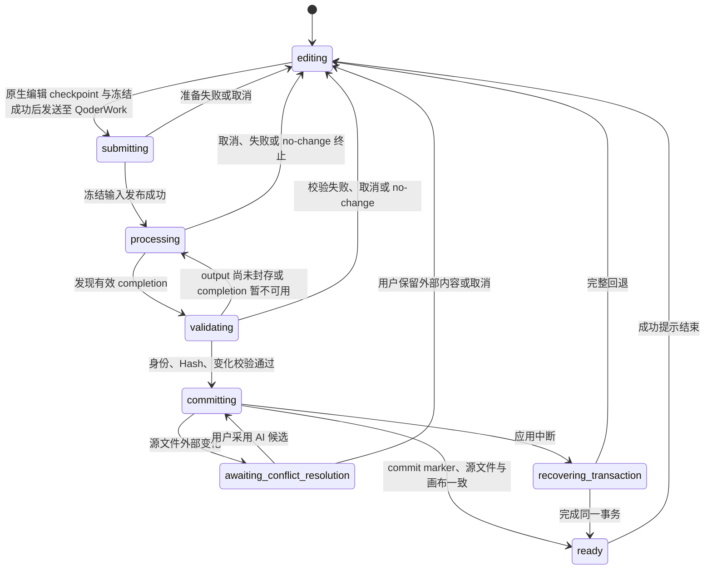

# PageRoot 交互流程

- 状态：v3 源码级定点修改目标交互合同
- 上位文档：[架构说明](ARCHITECTURE.md)
- 安全边界：[安全模型](SECURITY_MODEL.md)
- 产品范围：[MVP 产品需求](MVP_PRD.md)
- 文件协议：[Change Request 协议](CHANGE_REQUEST_PROTOCOL.md)

本文只描述目标流程。旧 0.5.x 中“手动保存建版”“稳定 HTML 自动完成”“恢复历史时复制为新版”“处理时锁住全部项目”等行为均不属于目标交互。

## 1. 用户心智模型

用户只需要理解三件事：

1. 我在当前 HTML 上直接编辑，系统自动更新文件。
2. 我把当前内容和评论冻结后发送至 QoderWork；只有冻结成功，当前项目才会锁住。
3. 内部 AI 真正完成且产生有效变化后，系统会新建下一份 HTML 并切换过去，不会覆盖我提交前的文件。
4. 修改前完整 HTML、修改后新工作文件和不可变历史 HTML 都会保留。

页面不要求用户区分临时文件、写入队列、事务目录或 commit marker；但所有状态文案必须反映这些底层事实。

## 2. 顶层导航

工作台包含：

- 当前项目入口。
- 当前文件名、版本与保存状态；文件名右侧常驻粗体“+”和斜向右上的外部打开图标，分别用于快速“打开本地HTML”和“在默认浏览器中打开”当前已知源文件。两者在鼠标悬浮或键盘聚焦时于图标右上方显示小号浅色浮层提示，不参与顶部栏布局计算；外部打开会先围栏刚送达的原生输入并等待该精确编辑 revision 安全写回，写回中保持禁用，失败时不启动浏览器。纯浏览器预览没有本地文件权限，因此仅展示禁用态的外部打开图标。桌面本地文件在安全保存时还可从文件名原位重命名，并提供“在文件夹中打开”快捷入口。
- 顶部栏为两行文件信息、编辑/预览、项目、全局评论与发送按钮保留完整垂直空间；常驻图标、文字和焦点轮廓不得越过底部分隔线。
- 当前 HTML 画布。
- 直接编辑工具。
- 评论与本轮要求面板。
- 自动写回状态。
- “一键发送至 QoderWork”主按钮。
- macOS 应用菜单中的“关于源页”入口；弹层以简洁文案说明本地 HTML 与 AI Agent 协作定位，展示当前版本、运行架构、更新频道和默认启用的使用数据边界，提供“检查更新”、GitHub 仓库和“用户声明与免责声明”入口，并把检查中、已是最新、等待下载、下载中、可以重启或失败原因原位展示。声明入口只打开安装包内随附的固定本地文本文件，不接受页面传入路径；使用数据说明不是确认弹窗，也不增加设置开关。
- 仅在正式签名的 macOS App 检测到 stable 新版本后，于发送按钮上方显示右对齐的红色斜体 `New!`；点击后才静默下载，下载期间不显示百分比或动效。下载完成后弹出“现在重启 / 稍后”确认；选择稍后时入口变为 `New! 重启更新`，再次点击打开同一确认。Canvas 不显示下载完成横幅，顶部也不新增图标。应用在启动约 5 秒后及持续打开期间每 4 小时检查 stable 更新，安装前仍执行同一套安全写入与关闭确认。
- 项目文件与交接详情。
- 版本历史。

“项目资料”使用用户语言解释：

- `PROJECT.md`：整个项目以后每次 AI 修改都会使用的长期规则；项目空闲时可修改，处理时只查看。
- `runtime-state.json`：系统记录项目当前是否在处理、锁定或恢复；只查看。
- `edit-audit.jsonl`：系统记录本地直接编辑的时间、位置和修改前后内容；只查看。

项目面板展开“项目资料”时自动准备项目记录，不要求用户先发送一次 AI 任务。入口分为“项目长期规则”和“项目记录文件夹”：前者说明以后每次 AI 修改都会读取，后者说明可在 Finder 查看每轮要求、AI 返回与历史文件。Finder 中的项目文件夹固定使用 `<HTML 文件名>__<项目创建时间>__<短项目标识>`，不直接显示完整 UUID；HTML 后续改名或移动不重命名项目记录文件夹。规则读取完成前不可编辑；未保存时离开或切换项目会被阻止，并明确要求保存或还原。

只打开顶部“项目”面板不登记项目。若项目资料建立失败，失败原因和“重试建立”留在展开区域；若 `PROJECT.md` 读取失败，编辑器不使用占位文案冒充文件内容，用户可以重试读取或返回项目。

文件菜单提供：

- 打开本地 HTML。
- 最近打开。
- 导出 HTML 副本。

主界面、文件菜单、原生菜单和右键菜单均不提供独立的“保存为 Version”动作。

## 3. 项目级状态机



状态含义：

| 状态 | 当前项目 | 允许动作 |
|---|---|---|
| `editing` | 可编辑 | 直接编辑、评论、提交、历史查看/恢复、导出；安全保存时重命名当前文件 |
| `submitting` | 已锁定 | 被动查看冻结页面与状态、取消、切换其他项目 |
| `processing` | 已锁定 | 被动查看冻结页面与状态、取消、切换其他项目 |
| `validating` | 已锁定 | 查看校验进度、取消、切换其他项目 |
| `committing` | 已锁定 | 查看提交进度、切换其他项目 |
| `ready` | 已解锁 | 查看本轮变化、开始下一轮 |
| `awaiting-conflict-resolution` | 已锁定 | 比较、采用 AI、保留外部、取消、切换其他项目 |
| `recovering-transaction` | 已锁定 | 查看恢复进度、切换其他项目 |

锁只属于一个 `projectId`。处理 A 项目时，用户仍能打开、切换和编辑 B 项目。

### 3.1 首次启动欢迎项目

桌面应用没有可恢复的当前项目时，不显示一个只有内存内容的假预览。系统会在所选工作区的上级目录建立 `欢迎来到源页.html`；默认位置是 `~/Documents/PageRoot/欢迎来到源页.html`，并立即：

1. 把它作为普通当前 HTML 加入最近项目。
2. 通过 Bridge 登记独立的 `projectId`、`documentId` 和初始 V1。
3. 按与用户打开 HTML 相同的源码写回、评论、附件、Request、QoderWork 交接和版本流程运行。

欢迎 HTML 只在文件不存在时写入；模板引用的 `brand-logo.png` 同时以受管普通文件写到 HTML 同级目录，桌面首次打开不得显示断图。用户对欢迎 HTML 的修改、AI 新版和项目记录在重启后继续保留，应用不得用内置模板覆盖。已有当前项目时仍优先恢复该项目，不额外创建或切换欢迎项目。纯浏览器预览没有桌面文件权限，继续使用只存在于内存中的欢迎内容和公开品牌图。

### 3.2 纯浏览器预览

纯浏览器预览是正式产品能力，但边界固定为只读：

- 默认进入“预览”，不能切换到“编辑”。
- PageRoot 的直接编辑、评论、附件、项目持久化和“发送至 Qoder”均不可用。
- 页面自身的脚本、表单与交互可以在 sandbox 内运行；顶部持续显示“浏览器预览 · 只读”“操作不会保存”。
- 离开预览不弹“是否保存”，因为 PageRoot 从未接受可写修改。

## 4. 打开已有 HTML

除首次启动时建立受管欢迎项目外，工作台不负责创建业务 HTML；用户打开已经由其他工具生成的本地 `.html` 文件。

当前文件名右侧始终保留独立的“+”按钮，点击后与文件菜单“打开本地 HTML”共用同一文件选择与项目切换流程。标题的小铅笔仍只在鼠标悬停或键盘聚焦时出现；两个入口的点击热区互不嵌套。若当前编辑、评论、附件或项目规则还没有安全收口，系统先沿用项目切换边界完成保存或阻止切换，用户取消文件选择时继续停留在当前 HTML。

1. 用户选择本地 HTML。
2. 系统优先按持久 `documentId` 重新绑定；无法识别时创建新 Document。
3. 若是新 Document，仅以未登记只读状态打开；第一次真实编辑、添加附件、发送给 QoderWork，或用户明确展开“项目资料”时才登记项目与初始 V1。
4. 通过 registry 中的 `storageDirectoryName` 定位项目文件夹，再读取该项目自己的 `project.json` 与 `runtime-state.json`。
5. 对照项目当前 `sourcePath` 指向的 HTML、latest committed Version 和运行时 Hash。旧原始路径或旧工作路径打开时，通过 registry 别名回到同一项目的最新 canonical path。
6. 按项目状态恢复：editing 时可恢复 current 或精确历史查看；存在 active run 时强制显示该轮冻结 current 页面，并默认展开“本轮处理”面板说明正在等待 AI 返回；冲突时显示该候选对比，事务恢复时显示恢复进度。用户主动收起处理面板后可以只读浏览冻结页面，直到再次打开或切回该项目前都不自动弹回。

不得通过扫描所有 `requests/`、取最新修改时间或猜测“哪个目录像处理中”来恢复状态。

### 4.1 顶部原位重命名

桌面版当前 HTML 满足以下条件时，顶部文件名才提供重命名：

- 当前项目处于 `editing`，没有 AI 处理、冲突、历史查看或页面切换。
- 自动写回为 `idle`，且 `editRevision=lastPersistedRevision`。
- 当前文件存在、Hash 与工作台已知值一致，Bridge 与桌面文件服务可用。

文件名平时保持普通标题外观；鼠标悬停或键盘聚焦时显示克制的编辑图标。用户双击文件名进入原位输入，也可在标题聚焦后按 `Enter` 或 `F2`。输入框只编辑主文件名，现有 `.html` / `.htm` 后缀以弱化文字固定显示，不允许改变目录。`Enter` 或失焦提交，`Escape` 取消。

提交重命名前，系统按项目切换同等边界收口原生文字输入、源 HTML 自动写回、评论/审计、附件与项目规则。任何一项仍未安全完成就留在输入框原位说明，不启动文件系统操作。

重命名事务顺序：

```text
稳定 operationId + 当前 sourcePath + 预期源 Hash
→ 在桌面活动文件记录写入 pendingRename
→ 确认目标同目录、同后缀且没有同名文件
→ 以独占硬链接占位并复核 inode/Hash
→ 删除旧路径；竞态时回滚且绝不覆盖目标文件
→ 把 active/recent 路径切换到新位置并写入 lastRename
→ Bridge 按物理文件身份重绑同一 projectId/documentId
→ Renderer 用新 sourcePath 刷新同一项目会话
```

同名目标已存在、名称非法、权限不足或 Hash 已变化时，旧文件与目标文件都保持不变，错误贴在文件名输入框下方，不弹全局 Toast。成功只把持续状态短暂改为“正在重命名…”，随后恢复“已安全保存”。

若应用在 `pendingRename` 写入后意外退出，下次启动根据旧、新路径和预期 Hash 完成或确认同一操作，再更新活动/最近记录。Bridge 通过文件物理身份重绑并同步 `project.json.name`；不得因为文件名变化创建新 Project、Document 或 Version。用户在 Finder 中自行移动或改名时仍沿用相同身份重绑规则，但运行中的工作台不通过猜测自动切换路径。

## 5. 直接编辑与自动写回

### 5.1 普通编辑

画布编辑区上方固定显示：

```text
本地文本编辑会直接修改源文件并保存
```

这里的源文件是项目当前指向的 HTML。首次打开时是用户选择的原始文件；第一次 AI 成功后是 `working/V1.1.html`，下一次是 `working/V1.2.html`。

每次编辑的交互顺序：

```text
单击选择文字宿主
→ 双击并把光标放到点击位置
→ IslandEditingController 建立一个与精确源码 contentRange 对应的可编辑岛
→ 浏览器提供光标 / Selection / IME，Controller 接管所有实际文字变更
→ 用户输入、删除或选择文字
→ 约 700ms 或格式、Cmd+S、目标切换、关闭、发送边界
→ 生成 replace-editable-island EditCommand
→ SourceIndex + TargetResolver 锁定源码范围
→ 岛内做最小安全规范化，SourcePatchEngine 生成精确 contentRange patch 与 inverse patch
→ 校验岛外字节完全不变，并重解析受影响区域
→ 用新源码原子重建 projection 并恢复逻辑选区
→ 内存 source HTML 立即更新
→ editRevision + 1
→ 记录 edit event
→ 顶部显示“正在更新…”
→ debounce 后进入同一串行队列
→ 核对源 Hash
→ 临时文件写入、刷盘、原子替换
→ 重读校验
→ lastPersistedRevision 前移
→ 显示“已更新到文件 · 时间”
```

连续快速编辑时：

- 旧 revision 的写入可以完成，但不得把新内存内容回滚。
- 队列继续处理最新 revision，直至 `lastPersistedRevision=editRevision`。
- UI 只在最后成功落盘后显示“已更新”。
- 画布 DOM 只用于预览和采集用户意图；不得把 `documentElement.outerHTML` 或整页 DOM 序列化结果写回源文件。
- `contenteditable`、IME 快照、运行时 nodeId 和逻辑选区只存在于当前会话；不能保存为第二份 HTML 或长期 JSON。
- flex/grid 文字只有在源码、运行时布局和 CSS selector 均安全时，才随首个真实 Patch 创建唯一 canonical 直接文字项；双击本身不修改源码。
- 任何目标为 `ambiguous`、`orphaned`，或 patch 越出已解析源码范围时都必须 fail-closed，保留当前源码并要求用户重新定位。

PageRoot 0.9.0 只使用一种文字编辑路线：

- 可编辑岛统一使用受控 `contenteditable="true"`。浏览器只负责焦点、光标、Selection 与 composition；普通输入、删除、换行、剪切和粘贴由 Controller 阻止默认行为后按逻辑位置执行。粘贴只读取 `text/plain`，换行固定写成 `<br>`。
- 可视段首、段尾、行中和非空行内样式交界都必须支持输入与删除。可视段首继承右侧首字符，其余边界统一继承左侧字符；工具栏显示下一次输入将采用的样式。
- 整个岛在一次会话内保持打开，短暂失焦不会结束编辑。切换目标、Escape、保存、导出、项目切换、关闭和发送是明确 checkpoint 边界。
- IME 开始时冻结岛内容与逻辑 Selection；结束时恢复快照，并把最终候选文字只插入冻结位置一次。没有完成的 composition 在失焦时取消，不猜测候选结果。
- `MutationObserver` 只允许 Controller 自己发起的子节点和文字变更；脚本、浏览器命令或页面事件造成的越权 DOM 变化立即恢复到最近一次安全草稿，并在当前视口提示。
- 岛可以包含安全行内语义、注释以及不可变的图片、SVG、MathML、Canvas、表单控件或媒体原子；这些原子及其属性不能被文字操作改写。脚本、样式、表单根、嵌入文档根及无法形成安全行内岛的块结构仍转为评论。
- 保存时只替换所选元素的源码内容范围。未编辑区域逐字节保持；编辑岛允许 parse5 为结构安全做最小规范化，但不得增加受保护属性、改变不可变原子或注释。

### 5.2 `Cmd+S`

`Cmd+S`：

1. 取消当前 debounce 等待。
2. 将最新 revision 送入同一队列。
3. 等待或反馈这次 flush 的真实结果。

它不创建额外事件、不改变 Version、不打开系统另存对话框。

### 5.3 写入失败

显示：

```text
更新失败 · 当前修改仍保留
[导出当前编辑内容]
```

同时：

- 保留内存内容。
- 保留短期恢复日志。
- 禁用“一键发送至 QoderWork”。
- 项目切换或关闭前要求用户处理，不静默丢失。

### 5.4 外部修改

写入前 Hash 不等于预期时显示：

```text
检测到文件被其他程序修改
[重新载入外部文件] [导出当前编辑内容]
```

在用户选择前，暂停自动写回并禁用提交。

## 6. 评论

### 6.1 创建

1. 用户选中模块、子区域或文字，或点击插入位置。
2. 用户点击“评论”。
3. 右侧面板显示目标标签与定位摘要。
4. 输入要求；可点击“添加图片或文件”，也可直接粘贴剪贴板图片。
5. 图片以可删除缩略图显示，点击后打开大图；文件以可截断文件名和大小的紧凑文件条显示。
6. 附件先复制到项目记录，正文、附件元数据和 TargetRef 再作为同一评论立即持久化；外部原文件路径不进入项目记录。
7. 画布显示评论标记。

评论及其附件持久化不依赖 HTML 写入，也不改变 Version。单条评论最多 10 个附件，单文件最大 25 MB；附件上传未完成时不能发送评论或提交本轮。选择批次中为空或超过 25 MB 的文件不占用剩余名额，同批有效文件仍正常加入；超限、空文件和数量溢出都在 Canvas 顶部持续提示。仍有容量时可“重新选择”，容量已满时可“查看附件”并先移除一个。

每条评论必须持久化 `TargetRef` 与当前解析状态：`exact`、`rebound`、`ambiguous` 或 `orphaned`。只有 `exact` 与经用户确认的 `rebound` 可进入提交；不安全状态必须在画布和评论面板同时显式提示。

全局评论使用稳定的 `body` 语义目标；首次登记、自动保存和恢复后仍保持 `exact`，不依赖正文 SourceAnchor。兼容旧草稿或历史记录时，以 `selector=body + level=module` 识别整个页面并补齐运行时字段；即使旧记录没有 `tagName` 或曾被标成 `orphaned`，也由系统确定性标准化，不向用户显示“重新定位”。

每条普通评论拥有独立于当前编辑选区的 TargetRef 身份；若变成 `ambiguous` / `orphaned`，评论文本和附件继续保留，后台重绑或清除旧选区不得把它静默指向某个候选。用户选择“重新选择目标”后，只有下一次明确的画布交互才能更新原评论的 TargetRef，不创建新评论或删除旧证据。发送前若仍有真正不安全的局部目标，入口必须打开并高亮第一条评论；完成后自动进入下一条。若用户是从“发送至 Qoder”进入恢复流程，全部目标安全后自动继续同一次发送意图。

同一项目同一时间只允许一条未保存评论。关闭输入框只会把当前正文、附件和 TargetRef 收起为右栏的一条“未保存评论”；附件上传尚未结束时不能收起。该评论点击“评论”保存前，不计入顶部发送数量，也不能为其他目标新建评论或发送本轮要求。系统明确提示“上一条评论还未保存”，并把用户带回原输入；保存后仍可在评论卡片中修改，再继续添加下一条。

在画布中单击内容只更新选择框和对应评论的高亮，不主动改变共享滚动位置。点击模块自身没有内容覆盖的 padding 留白只清除当前选择，不把布局空白解释成一次模块选择。只有用户从评论卡片、未保存评论入口或重新定位流程明确要求前往目标时，系统才滚动到对应内容。

### 6.2 修改与删除

每次修改更新 `updatedAt`，保持同一 `commentId`。为已有评论增删附件同样保持原 `commentId`。删除只影响当前草稿；已经冻结到 Request 或归档到正式 Version 的历史记录与附件不可变。提交时系统优先用 copy-on-write 把项目草稿附件冻结到当前 Request，不支持时自动完整复制，并在 Request 发布前完成文件与目录同步。

评论卡片正文以 14px 显示。常态不为附件、图片、编辑和删除四个工具保留高度；鼠标悬停、键盘焦点进入卡片或进入编辑状态时，才展开 30px 工具栏及 6px 间距，且工具栏上方不显示分隔线。常态、定位聚焦和编辑态均只保留一层卡片边界与柔和阴影；编辑框使用无边框浅色底面和底部焦点线，不在卡片内部重复形成第二层边框。

每次草稿修改都携带稳定 `operationId` 与期望 revision。Bridge 已确认的
operation ID 和删除 tombstone 持久化在同一草稿记录中；删除不会因为旧页面
随后提交一份较早快照而复活。若页面持有 revision 104、Bridge 已到 106，
系统先读取 106，把尚未确认的本地操作重放到权威草稿，再用新前提重试。
POST 超时也按“结果未知”处理：先查询 operation 是否已经被确认，不能盲目
重复提交，更不能要求用户反复点击“继续编辑”。

### 6.3 当前编辑事实

文字、样式和排序的 edit event 显示在“本地修改记录”中。它们说明当前 HTML 如何从谱系基础演变，但不代表已经形成另一个版本。

## 7. 发送至 QoderWork

### 7.1 提交、冻结成功后锁定

用户按下“一键发送至 QoderWork”后必须先完成：

```text
commit pending native edit checkpoint
→ validate comments / ensure project
→ freezeNow() returns exact html + sha + revision
→ projectLocked = true
→ lifecycleState = submitting
```

提交准备意图在任何异步登记之前同步占位；快速双击、键盘快捷操作或重复事件只能复用/退出，不能并行建立两个 Request。若用户已打开过“项目资料”，提交沿用同一项目登记结果。

`POST /request` 最多等待 60 秒。若超时发生在请求已经发出之后，客户端不得直接解锁或再次提交，而是读取 `/workspace` 核对持久运行态。核对同样有 15 秒边界；短暂失败继续由后台下一轮自动核对，不累计为“重试”提醒，也不在本轮面板提供“重新打开源页”。只有整个工作区服务确认不可用时，Canvas 上方的持久横幅才提供导出与重新打开；成功确认没有活动任务后自动恢复编辑。

原生编辑 checkpoint 或 freeze 失败时立即停止：不锁定、不建立 Request、不复制旧内容。

冻结成功并锁定后：

- 画布、工具条、评论、项目规则修改和主按钮均真实 disabled；历史版本本来就是只读能力，不存在替换入口。
- 第二次 click、pointer、keyboard submit 被去重。
- 屏幕阅读器获得“当前项目已锁定”的状态通知。
- 项目规则与版本历史仍可只读查看，HTML 副本仍可导出，也可再次复制交接内容。

不得只显示遮罩而让底层控件仍可触发。

### 7.2 持久化并发布冻结输入

`freezeNow()` 已在锁定前同步捕获 `freezeCutoffRevision`、提交原生编辑 checkpoint，并返回同一 revision 的 HTML 与 source SHA。锁定后继续：

1. flush 同一自动写回队列。
2. 等待 `lastPersistedRevision` 追平冻结 revision。
3. 重读当前 HTML，确认磁盘 Hash、持久 revision 与 `freezeNow()` 结果完全一致。
4. 把冻结的完整字节复制到 Request 的 `input/base/index.html`，并记录 `baseSnapshotSha256`。
5. 冻结评论、附件和不晚于 cutoff 的 edit event；附件 Hash 或大小与选择时不一致则整次提交失败关闭。
6. 读取 `latestVersionId` 与 `currentBasedOnVersionId`，分配下一候选 Version 身份。
7. 写入 Request 与 Attempt 目录并切换到 processing。

顶部变为：

```text
正在生成版本 9
基于版本 5 · 16:34 提交 · 1 条要求
当前项目已锁定
```

若持久 revision 或磁盘 Hash 复核失败，系统回到 editing；同一评论、edit event 和当前 HTML 保持不变，不发布 Request。

冻结成功后，`input/base/index.html` 永远是本轮修改前的完整版本。AI 不直接修改它，也不直接修改提交前当前 HTML。

### 7.3 剪贴板交接

交接详情显示：

- Request/Attempt。
- 候选版本 9。
- 基于版本 5、上一正式版本 8。
- 冻结时间和评论数量。
- Prompt、Request、输入快照与 Attempt 路径。
- 每个附件在当前 Request 内的本机绝对路径和相对回退路径，不包含外部原文件路径或 Base64。
- 系统在发布 Request 时把交接消息写入剪贴板，并逐字 readback；只有一致才显示“交接内容已写入剪贴板”，同时明确“不代表 Qoder 已收到”。
- 复制状态按 `sourcePath + requestId + attemptId` 保存。A 项目复制失败只让 A 显示“重新复制”；切换到 B 后，B 的发送和复制状态独立计算。
- 产品不自动打开、控制或粘贴到 QoderWork；用户自行新建对话并粘贴。

用户选择“预览已发送 HTML”后，画布必须按冻结 HTML 的原始视觉强度正常显示，不沿用处理面板的降饱和或透明弱化。顶部返回横条先完整显示，3.5 秒后收起到 2px 提示线；鼠标扫过顶部感应区或点击提示线时平滑展开，并在一次完整展示时间后重新收起。键盘焦点进入时同样展开，但在焦点离开前保持可见。历史版本等带返回操作的只读 HTML 预览使用同一行为；阻断错误与冲突提示不自动收起。系统开启“减少动态效果”时保留状态切换，但不播放位移动画。

用户把消息粘贴给内部 AI。AI 只能处理指定 Request/Attempt。

### 7.4 结束已交接的本轮

剪贴板已确认写入后，用户点击“结束本轮并继续编辑”必须先看到一个简短确认弹窗：

- 标题：“AI Agent 可能仍在修改”
- 说明：“结束本轮后，AI Agent 的修改将不会保存到源页。建议先停止 AI Agent。”
- 安全按钮：“继续等待”，默认获得键盘焦点。
- 结束按钮：“结束本轮并继续编辑”。

`Escape`、点击遮罩或“继续等待”只关闭弹窗，不改变 Request。若剪贴板交接失败，没有证据表明 AI Agent 已经收到任务，“取消本轮”仍可直接结束。

用户确认结束后，工作台写入受控 `cancelled.json`、释放候选并立即恢复当前源 HTML 的编辑，不删除 Attempt 或它的 output 路径。界面只显示：“本轮已结束，已恢复编辑”“AI Agent 不会被自动停止；如仍在运行，请手动停止。”产品不声称也不尝试停止外部 AI Agent。

## 8. 内部 AI 处理与完成

### 8.1 处理中

内部 AI：

1. 读取 Prompt、v3 Request、input manifest、项目规则和冻结输入。
2. 只修改明确目标及聊天补充指向的位置。
3. 将完整 HTML 写入唯一 `output/index.html`。
4. 完成全部写入后执行 Prompt 给出的完整 finalizer 命令。

产品可以用文件可读性检查辅助显示进度，但不得把“暂时没有变化”解释为完成。
用户在 Finder 查看本轮目录时，普通、非软链接 `.DS_Store` 属于无语义的系统显示元数据：工作台和 finalizer 忽略它，但继续拒绝其他未声明文件、目录或软链接。

### 8.2 唯一完成信号

finalizer 最后原子写入 `completion.json`。工作台发现它后进入 `validating`。
“AI 已返回”只由这个完成信号或其后的生命周期状态点亮；完成信号出现前发生的错误显示“未检测到 AI 返回结果”，不能因为通用 `error` 状态而打勾。

若用户已经结束本轮，官方 finalizer 在校验受控取消标记后返回 `status=cancelled`、`accepted=false`、`retryable=false`，不修改 output、不写 `completion.json`、不创建 Version。Prompt 必须要求 AI Agent 收到该结果后立即停止，不重试，也不改写到其他路径；这是一种正常取消终态，不是保存或路径故障。

以下画面仍保持 processing：

- output 已存在但 completion 不存在。
- output 看起来完整或标签闭合。
- output 已经 30 秒未变化。
- 旧 output 或 AI 摘要存在。

### 8.3 校验

校验顺序：

1. completion Schema 和 finalizer 版本。
2. 项目、文档、Request、Attempt。
3. basedOn、previous 和 candidate 身份。
4. active run 仍有效。
5. 冻结基础 Hash。
6. 实际 output Hash。
7. HTML 完整性。
8. ScopeValidator 对冻结基础、目标引用和 output 执行强制范围审计。
9. `scope-report.json` Schema、证据 Hash 与 `verdict=pass`。
10. 规范化比较 Hash。
11. completion 写出后 output 未变化。

任何失败均不建版。界面显示明确错误与可恢复动作。

范围校验失败时必须保留 Request、Attempt、output 与完整报告，释放候选号并返回可编辑态；失败候选不得复用，也不得通过 finalizer 元数据白名单掩盖任何实质越界变化。

处理面板不逐条暴露上述内部检查，而是固定合并成四个用户阶段：
“准备并复制”“等待 AI 完成”“校验并保存”“结果”。每轮只允许一个当前阶段；
复制失败落在第一阶段，完成记录缺失落在第二阶段，校验失败或外部冲突落在第三阶段，
成功、无变化和最终选择落在第四阶段。完成记录出现前不得把第二阶段显示为完成。

四个阶段使用等宽卡片按序号展示：左侧分别使用交接确认、等待、保存和结果图标，
右侧明确显示“进行中”“待进行”或完成标记。校验阶段使用保存图标，并说明 AI
完成后会自动校验并写入本地；底部操作区不显示分隔线，按钮靠近内容区顶部对齐。

等待 AI 时提供结束本轮、预览与再次复制操作；已经完成剪贴板交接时，结束本轮先经过
7.4 的确认边界。复制失败、校验中、成功、无变化和
外部冲突只显示各自下一步所需的底部操作。所有新增操作复用同一套底部按钮层级，
不得再在流程卡片内复制一套决策按钮。

### 8.4 no-change

如果规范化比较 Hash 相同：

```text
内部 AI 未产生有效变化
本轮要求和诊断已保留
[修改要求后重新提交]
```

系统：

- 不创建 V9。
- 不创建对应的 `working/V1.x.html`。
- 释放候选号。
- 保留 Request、Attempt、评论和诊断。
- 解锁并回到 editing。

## 9. 新 Version 提交与打开

### 9.1 提交事务

校验存在有效变化后进入 `committing`：

```text
准备 Version 与恢复文件
→ 事务标记 prepared
→ 再次核对源 Hash
→ 新建且不覆盖 working/V1.x.html
→ 事务标记 source-applied
→ 发布 versions/ver_0009
→ 写入 committed.json
→ 把项目当前路径切换到 working/V1.x.html
→ 重建项目缓存
→ 从新工作文件重新打开
→ 校验工作文件/快照/画布三个 Hash
```

`committed.json` 是 Version 正式可见的唯一提交点。

事务中的 `source-applied` 表示“候选工作文件已完整创建”，不表示旧源文件已被覆盖。同名工作文件已存在且内容不同就失败关闭。

### 9.2 成功提示

只有全部完成后显示：

```text
V1.8 已生成并打开
生成于 16:41 · 基于 V1.4
[查看本轮变化]
```

此处不能使用“历史版本已打开”，因为当前打开的是刚刚创建并成为项目 current path 的新工作文件。内部 Schema 仍可能把同一版本记为 V9；界面按 ordinal 显示为 V1.8。

### 9.3 评论归档

成功事务中：

- 冻结评论与 edit event 写入 Version 归档并与 Request/Attempt 关联。
- 校验归档数量与 Hash。
- 成功后才从“本轮要求”清空。

任何失败、取消、冲突、no-change 或重启都不能提前清空。

## 10. 外部冲突流程

AI 完成后发现源 Hash 已变化：

```text
候选 V9 等待处理
源 HTML 已被其他程序修改
[比较外部内容与 AI 候选]
[采用 AI 版本] [保留外部版本]
```

### 10.1 采用 AI 候选

1. 记录用户确认时间和当前外部 Hash。
2. 保存外部内容为恢复文件。
3. 更新事务的 `expectedSourceHash`。
4. 再次读取源文件；若继续变化，留在冲突状态。
5. 未再变化时创建新的 `working/V1.x.html` 并继续同一候选 V9 的事务；外部修改后的旧文件保持不变。

`basedOnVersionId` 和 `baseSnapshotSha256` 保持冻结值，用于审计。

### 10.2 保留外部内容

1. 放弃未提交候选。
2. 不写 commit marker。
3. 释放 V9 候选号。
4. 以外部内容重新打开 current。
5. 恢复冻结评论。
6. 回到 editing。

### 10.3 重启

冲突状态、候选路径和三侧 Hash 从项目 `runtime-state.json` 与事务日志恢复。迟到 completion 不得绕过用户选择。

## 11. 历史

### 11.1 版本卡片

每张卡片显示：

```text
V1.8 · 生成于 16:41
基于 V1.4 · 上一版 V1.7
优化指标卡片层级与标题间距
1 条评论 · 1 条本地修改记录
[只读查看] [在 Finder 中显示]
```

活动历史只读取严格 v3 的 `initial` 与 `internal-ai` Version。旧 `local-editor`、`restore` 或 v1/v2 manifest 只存在于切换前只读归档，新程序不读取、展示或混入当前历史；其中的 HTML 快照只能作为普通文件重新登记为新 Document 和 V1。

内部 `V1/V2/V3` 与界面 `V1.0/V1.1/V1.2` 按同一 ordinal 一一对应。历史卡片必须在抽屉可用宽度内自动换行，不能要求用户左右滑动才能读完标题、摘要、评论或修改前后内容。

### 11.2 查看历史

点击“查看此版本”：

1. 设置 `viewMode=history`。
2. 设置精确 `viewingVersionId`。
3. 只读取 `versions/<id>/files/index.html`。
4. 校验实际 Hash 等于 manifest。
5. 显示只读横幅。

```text
正在查看 V6（只读）
当前项目：基于 V9
[返回当前 HTML]
```

只读横幅沿用预览导航横条的自动收起与重新展开行为，收起后不得持续遮挡历史 HTML；键盘用户聚焦横条时必须自动展开并保持返回按钮可操作。

路径缺失或 Hash 不符时显示错误，不能回退显示当前源 HTML、其他版本或渲染缓存。

点击“在 Finder 中显示”时，桌面端只允许定位该卡片对应的 `versions/<versionId>/files/index.html`。路径必须位于当前项目的不可变 Version 目录内且通过普通文件、非软链接校验。

### 11.3 返回当前 HTML

点击“返回当前 HTML”：

1. 设置 `viewMode=current`。
2. 清空 `viewingVersionId`。
3. 从项目 canonical `sourcePath` 指向的当前 HTML 重新读取。
4. 更新 `renderedContentSha256`。

### 11.4 历史版本保持只读

历史卡片不提供“用此版本替换当前 HTML”“设为当前 HTML”或同义入口；Bridge 也不暴露历史回写路由。用户可以只读查看、返回当前 HTML，或在 Finder 中定位不可变版本文件。若确实要以旧 HTML 开始新的工作，应把该快照作为普通文件重新打开，建立清晰的新 Document 与 V1，避免在现有版本链中隐式改写谱系。
## 12. 项目切换

### 12.1 处理期切换

A 项目 processing 时切换 B 项目：

- A 的 runtime state 与锁保持。
- B 按自己的 runtime state 渲染。
- A 的复制、取消、校验记录、冲突处理和打开结果等异步回调只更新 A；不得清除或覆盖 B 的按钮状态。
- 最近项目列表显示 A 的“正在处理”“新版本可查看”“已完成 · 无变化”或“需要处理”；除新版本刚完成的一次轻提示外，不用全局错误抢占 B。
- 回到 A 时精确恢复 frozen comments 和 active run。

不得使用一个全局 `runInProgress`、`generating` 或 Qoder copy state 锁住所有项目。各后台状态轮询并行执行，单个慢项目不能延迟其他项目。

### 12.2 关闭与重启

关闭前：

- 关闭、项目切换、发送和历史导航使用同一个 drain coordinator；各状态所有者只登记自己的义务，不在入口处重复拼装“安全”布尔判断。
- 各项目 autosave 队列必须完成或明确显示失败。
- 未完成附件上传和 `PROJECT.md` 自动保存必须完成或明确显示失败。
- 草稿会执行一次最终校验；若内容、删除记录和 edit event 的权威指纹未变化，该校验是 no-op，不发起 POST，也不增加 revision。
- 草稿 revision 冲突或 POST 结果未知时自动读取权威草稿、重放未确认 operation 并在有新前提后有限重试。只有无法确定性合并的真实语义冲突才阻止离开。
- 若 `editRevision > lastPersistedRevision` 却意外缺少 queued write，关闭或切换边界必须从当前内存 HTML、revision 与待审计事件重建恢复写入，不能永久停在“未保存”。
- 旧项目的登记或 autosave 失败回调只能写入旧项目恢复记录，不能占用当前项目的 pending write。
- active run、冲突和事务状态已经持久化。
- 收起处理面板只隐藏详情，不取消后台任务；收起后的透明遮罩不得继续拦截画布。
- 处理面板不显示右上角关闭符号，可用 `Escape` 收起；面板显示期间顶部“项目”仍可用。当前项目的补充记录或加载错误只能锁住该项目的编辑区，不得禁用全局项目入口。

只用于边界复核的义务不能被计为永久 pending；`alwaysDrain` 表示进入边界时
调用所有者做一次验证，不表示项目永远“尚未安全保存”。

遥测不属于关闭义务。退出时可以在很短的时间预算内尝试发送已有批次，
但网络失败、队列落盘失败或超时都不能阻止关闭、重启更新或项目切换。

重启后：

- 逐项目恢复。
- `runtime-state.json` 决定 active run。
- 事务日志决定继续提交、回退或进入冲突。
- commit marker 决定历史可见性。

## 13. 锁定矩阵

| 动作 | editing | submitting/processing/validating/committing | conflict/recovery | 其他项目 |
|---|---:|---:|---:|---:|
| 当前画布编辑 | 允许 | 禁止 | 禁止 | 按该项目状态 |
| 当前评论修改 | 允许 | 禁止 | 禁止 | 按该项目状态 |
| 当前历史查看 | 允许 | 禁止 | 仅冲突候选对比 | 按该项目状态 |
| 当前历史替换 | 不提供 | 不提供 | 不提供 | 不提供 |
| 当前项目规则修改 | 允许 | 禁止 | 禁止 | 按该项目状态 |
| 当前导出 | 允许 | 禁止 | 禁止 | 按该项目状态 |
| 再次提交 | 允许 | 禁止 | 禁止 | 按该项目状态 |
| 取消本轮 | 不适用 | 允许；剪贴板已交接时先确认，committing 提交点后除外 | 允许，按恢复规则 | 不受影响 |
| 打开/切换项目 | 允许 | 允许 | 允许 | 允许 |

## 14. 时间与状态文案

| 底层事实 | 文案 |
|---|---|
| autosave 正在处理 | `正在更新…` |
| 源 HTML 写入成功 | `已更新到文件 · 16:32` |
| Request 已冻结 | `16:34 已复制，可粘贴至 QoderWork` |
| completion 已生成 | `内部 AI 于 16:40 完成` |
| commit marker 已写入、canonical path 已切换并三 Hash 一致 | `V1.8 已生成并打开 · 16:41` |
| history 模式 | `正在查看 V6（只读）` |

这些时间来自各自事件，不互相代替。

## 15. 关键错误状态

| 场景 | 结果 | 用户动作 |
|---|---|---|
| 自动写回失败 | 不提交、保留内容 | 重试或导出 |
| freeze flush 失败 | 回到 editing | 修复后重试 |
| output 无 completion | 继续 processing | 等待 AI finalizer |
| Finder 写入普通 `.DS_Store` | 忽略并保持原状态 | 无需处理 |
| completion 身份不符 | 不建版 | 检查正确 Attempt |
| output Hash 不符 | 协议错误 | 重新生成并 finalizer |
| completion 后 output 变化 | 协议违规 | 新 Attempt |
| no-change | 不建版 | 修改要求后再提交 |
| AI 失败或取消 | 不建版、不创建工作文件 | 修改要求后再提交 |
| 取消后 AI 才运行 finalizer | 返回不可重试的 `cancelled` 终态，不建版 | 停止 AI Agent |
| 浏览器文件不是 UTF-8 | 不载入、不修改原文件 | 转换编码后重新选择 |
| 附件为空、超过 25 MB 或超过 10 个 | 无效项不加入，有效项保留 | 重新选择其他文件 |
| 源文件外部变化 | 持久冲突 | 采用 AI 或保留外部 |
| Version 路径缺失 | 不显示成功 | 恢复事务或报错 |
| 提交中崩溃 | recovering-transaction | 自动完成或完整回退 |

## 16. 交互验收

1. 连续本地编辑并自动写回 20 次，历史不增加。
2. `Cmd+S` 不改变版本号。
3. 提交事件同一时刻锁定；快速双击只生成一个 Request。
4. A 项目处理中可以编辑 B 项目。
5. 只写 output 并等待 30 秒，不建版。
6. finalizer completion 有任一 ID 或 Hash 错误，不建版。
7. no-change 不消耗候选号，评论保留。
8. 成功 V9 只在新 `working/V1.x.html`、快照、画布三 Hash 相同且项目路径已切换后提示。
9. 查看 V6 永远只读且打开精确路径。
10. 用 V5 替换当前内容不建版；下一次有效 AI 返回仍按时间线成为 V9。
11. 外部冲突重启后仍停留在同一候选和同一 Hash 对比。
12. 每个事务边界崩溃后，不出现半提交状态。
13. 连续两次 AI 成功后，原始 HTML 和第一份工作文件逐字节不变，项目当前路径指向第二份工作文件。
14. no-change、失败和取消均不创建下一个 `working/V1.x.html`。
15. 历史抽屉无横向滚动，且“在 Finder 中显示”只定位对应不可变 HTML。
16. 处理中查看 Request/Attempt/output 并产生普通 `.DS_Store`，仍保持 processing 且 finalizer 可正常完成；同名软链接和其他额外文件继续失败关闭。
17. completion 出现前的失败不点亮“AI 已返回”；completion 出现后的校验失败保留已返回事实。
18. 剪贴板已交接时点击“结束本轮并继续编辑”，先显示精简的 AI Agent 风险确认；“继续等待”不改变 Request。
19. 确认结束后立即恢复编辑并显示手动停止 AI Agent 的提醒；迟到 finalizer 可重复返回同一不可重试取消终态，且不写 completion、不建版、不改变源 HTML。
