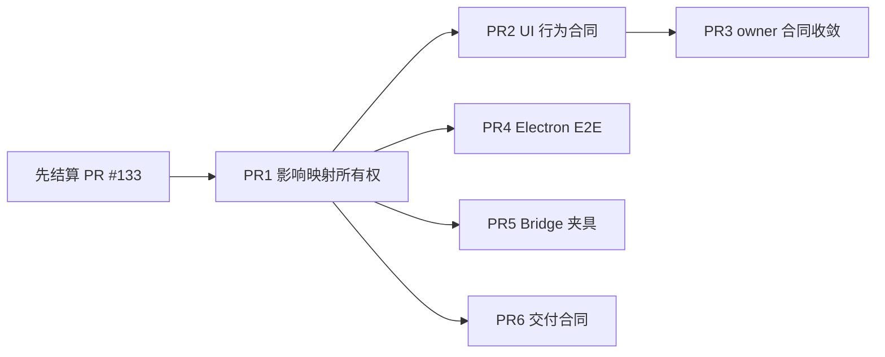

# PageRoot 测试收敛 PR 执行合同

> 文档状态：执行前合同，不是实施结果
> 事实基线：`origin/main@4e7e63c9ca1b241c40cba63af882079334962568`，2026-08-10 复核
> 开放前置：PR [#133](https://github.com/Charleyli925/PageRoot/pull/133) 仍为 Ready/Open，head `9ca8121568cf534320f1cd583ee02741f55c4b5a`
> 适用执行器：Terra Max 或能力等价的编码代理
> 授权边界：这些文档只授权未来 PR 在各自明确范围内收敛测试；不授权 merge、tag、打包、签名或 Release

## 1. 总目标

本计划不以“删除最多测试”为目标，而是把同一行为在不同层重复证明、依赖源码字符串形状、以及影响映射过宽造成的维护负担收敛掉。

完成后的目标是：

1. 日常代表性改动选中的 Node 测试总量至少下降 50%；
2. `release` 完整门禁仍运行完整 Node、Browser、真实 HTML、Native Electron 和 AI 闭环；
3. 每个被删除或合并的测试都有新的明确 owner 和等价或更强的独立 oracle；
4. 测试代码净减少目标为 8,000–12,000 行，若只能通过删除唯一 oracle、搬运到夹具、压缩格式或弱化断言达到，则停止而不是追指标；
5. 不修改产品行为，不以测试清理为由重构 `app/workbench.tsx`、`scripts/workspace-bridge.mjs` 或任何生产协议。

当前基线有 44,908 行 JS/TS 测试代码；前 15 个测试文件合计 22,983 行，占 51.2%。最近一次已核对的完整候选门禁为 [CI run 31382350936](https://github.com/Charleyli925/PageRoot/actions/runs/31382350936)，从创建到完成约 5 分 22 秒。证据说明当前主要问题是维护结构和日常选择放大，不是完整门禁已经慢到不可用。

## 2. PR 文档

| PR | 单一结果 | 严格前置 | 是否可与同批开发 | 执行合同 |
| --- | --- | --- | --- | --- |
| PR1 | 收窄影响映射并建立所有权基线 | PR #133 已结算并同步最新 `main` | 否，先完成 | [PR-01-impact-map-ownership.md](./PR-01-impact-map-ownership.md) |
| PR2 | 用行为 oracle 替代 UI 源码字符串合同 | PR1 已合并 | 可与 PR4/5/6 并行开发 | [PR-02-ui-contract-behavior.md](./PR-02-ui-contract-behavior.md) |
| PR3 | 将剩余跨 owner 源码合同收敛到真实 owner | PR2 已合并；建议等本批其余 PR 均合并后再结算 | 否，依赖 PR2 | [PR-03-owner-contract-convergence.md](./PR-03-owner-contract-convergence.md) |
| PR4 | 收敛 Electron/AI E2E 夹具和重复场景 | PR1 已合并 | 可与 PR2/5/6 并行开发 | [PR-04-electron-e2e-consolidation.md](./PR-04-electron-e2e-consolidation.md) |
| PR5 | 统一 Bridge 集成测试环境并去除重复生命周期脚手架 | PR1 已合并 | 可与 PR2/4/6 并行开发 | [PR-05-bridge-harness-consolidation.md](./PR-05-bridge-harness-consolidation.md) |
| PR6 | 收敛桌面包、候选和 provenance 重复合同 | PR1 已合并 | 可与 PR2/4/5 并行开发 | [PR-06-delivery-contract-consolidation.md](./PR-06-delivery-contract-consolidation.md) |

## 3. 批次与依赖



你的理解基本正确，但要区分“可并行开发”和“可并行合并”：

- PR1 必须先合并。
- PR2、PR4、PR5、PR6 可以分别从 PR1 合并后的同一个 `main` 创建独立分支并行开发。
- 这四个 PR 仍会共同触及 `tests/test-impact-map.json`、`tests/TEST_STRATEGY.md`，部分还会触及 `scripts/test-node-group.mjs`；因此它们必须逐个重基、逐个验证、串行合并。
- PR3 依赖 PR2 对 UI 源码合同的清理结果。为降低冲突，推荐在 PR2/4/5/6 都进入 `main` 后再完成 PR3 的最终重基和结算。

推荐合并顺序：

1. PR1；
2. PR2；
3. PR4、PR5、PR6，三者顺序可按先完成先合并，但每次合并后下一个都重基；
4. PR3 最后合并。

## 4. 每个 PR 的统一执行协议

Terra Max 在执行任何一份合同前必须：

1. 完整阅读仓库根目录 `AGENTS.md`，以及该 PR 文档列出的必读文件；
2. `git fetch origin --prune`，查询实时开放 PR，并记录当前 `origin/main` SHA；
3. 确认严格前置已经合并，而不是仅仅 Ready、绿色或存在本地分支；
4. 从最新、干净的 `origin/main` 创建独立 worktree；不得在用户脏主工作区中修改、stash 或 reset；
5. 在修改前记录目标文件行数、测试名、当前选择计划或当前测试结果；
6. 只修改该合同“修改清单”列出的文件。发现必须修改生产行为、协议或新增 owner 时立即停止；
7. 为每个删除或合并的测试在 PR 描述中填写以下迁移表：

| 旧测试/场景 | 新 owner | 新文件/测试名 | oracle | 门禁层 | 是否已运行 |
| --- | --- | --- | --- | --- | --- |
| 示例 | `CommentSession` | `tests/comment-session.test.mjs` | 状态与 operation identity | Node | 是 |

8. 运行聚焦测试、`npm run gate:edit`，完成后运行 `npm run task:finish`；
9. 检查 `git diff`，确认没有通过移动到非测试目录、压成超长行、生成代码或删除注释来伪造 LOC 降幅；
10. 只创建 Draft PR。最终重基当前 `main`、冻结 head 后，按仓库流程 Ready 一次；本文档不授权 merge。

## 5. 并行分支的冲突协议

以下文件属于共享冲突面：

- `tests/test-impact-map.json`
- `tests/TEST_STRATEGY.md`
- `scripts/test-node-group.mjs`
- `tests/test-gate-selection.test.mjs`

处理规则：

1. 不得对 `tests/test-impact-map.json` 使用 “ours/theirs” 整文件取舍；必须按规则 ID 逐项合并。
2. 删除测试文件时，同时删除所有 impact-map、Node group 和文档引用；保留其他已合并 PR 新增的规则。
3. 每次重基后先运行 `node --test tests/test-gate-selection.test.mjs`，再运行该 PR 聚焦测试。
4. 如果两个 PR 修改了同一个测试场景，而不是仅修改共享索引文件，停止并报告重叠，不自行决定哪个 PR 吞并另一个。
5. 并行分支不得互相 cherry-pick 未结算提交形成隐式堆叠；需要依赖时必须在文档中升级为显式前置。

## 6. 全局边界

整个计划必须保持：

- Source HTML 原始字节、SourceIndex、TargetResolver、TargetRef 和 SourcePatch 权威链；
- Selection、IME、composition、native edit generation/lease 和 exact inverse 行为；
- Source Hash、CAS、原子替换、外部冲突、失败关闭和重启恢复；
- SourceTransaction 所有 commit point、故障注入、audit exactly-once 和 history 一致性；
- AI 协议、身份、Hash、路径、完整 HTML、scope/attention 和正式 finalizer；
- Edit 不执行 authored scripts，Preview 隔离，Review Runtime Snapshot 仅为可丢弃补充证据；
- package Bundle/Tree、app.asar、Bridge、Schema、签名、公证、启动和 provenance 合同；
- 完整 Ready 候选的全量 Node、Browser、真实 HTML、Native Electron 和 AI 闭环。

整个计划明确不做：

- 不删除产品功能或缩小兼容窗口；
- 不新增 Redux、全局 store、测试专用生产 API 或新的测试框架；
- 不修改超时、重试、skip、worker 数量来制造绿色；
- 不把源码字符串测试机械搬到另一个文件；
- 不自动修改 GitHub workflow、merge、打包、签名、tag 或 Release；
- 不把 `ci-health-report.test.mjs`、`pr-review-policy.test.mjs`、`review-debt.test.mjs` 仅因文件较大就纳入删除范围。

## 7. 总体验收

所有 PR 串行合并后，在最终干净 `main` 上至少满足：

```bash
npm run gate:release:auto
```

预期：完整 release suite 清单与 PR1 前基线一致，所有自动门禁通过。

另外重新运行 PR1 中的代表性影响映射审计，预期：

- 七个代表文件的 `selectedNodeTests.length` 合计从 113 降到不高于 56；
- `release` lane 仍固定包含 `typecheck`、`lint`、`dependency-audit`、`build-web`、`node-full`、`browser-full`、`real-html`、`build-desktop`、`electron-full`、`ai-closed-loop`；
- 测试代码净减少目标 8,000–12,000 行；若安全完成后低于目标，按未决风险汇报，不追加无证据删除。

## 8. 全局停止条件

出现任一条件，当前 PR 停止修改并向用户汇报：

- 当前代码、测试名、调用链或 ownership 与合同事实不一致；
- PR #133 或新的开放 PR 修改同一文件或同一行为边界；
- 被删测试是目前唯一可观察 oracle，且没有已存在的更低成本 owner；
- 必须新增生产 API、owner、协议或改变产品行为才能测试；
- 必须扩大到另一个 PR 的职责才能保持绿色；
- 只能通过增加 timeout/retry、跳过场景或降低断言强度通过；
- `release` 完整 suite 清单发生变化；
- 共享夹具引入跨测试状态、顺序依赖或并发污染；
- LOC 下降只能通过搬运、压缩、改扩展名或生成代码达到。

## 9. 全局未决风险

- 44,908 行和 113 次代表性选择来自 2026-08-10 的静态基线；执行时必须重测，不能当成未来事实。
- `assert.match` 数量只能证明实现形状依赖很重，不能单独证明每条断言都重复。
- AI Electron 21 个场景中哪些是唯一跨进程 oracle，仍需 PR4 逐场景迁移表确认。
- 公共 Bridge/Electron 夹具可能降低重复，但也可能引入隐式共享状态；必须用隔离工作区和顺序独立性验证。
- 8,000–12,000 行是安全收敛目标，不是无条件承诺；在不缩减产品/兼容范围的前提下，不能把“删除 50% 测试 LOC”当作已证实可行。
